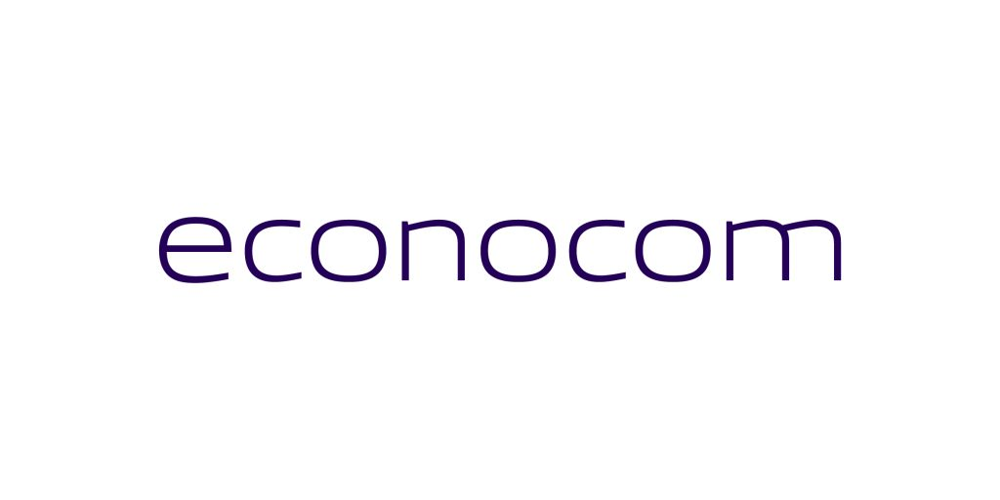

# Remerciements

Il est de coutume, dans l'exercice d'une œuvre d'une telle envergure, de gratifier ceux qui, par leur présence ou leur contribution, ont daigné accompagner mon génie. Je condescends donc à exprimer ma reconnaissance, bien que l'excellence de ce mémoire soit, en grande partie, le fruit de mon intellect souverain.

À mon directeur de thèse, dont les conseils, bien qu'occasionnellement utiles, n'ont fait que confirmer les orientations que j'avais déjà brillamment tracées. Votre rôle, bien que marginal face à ma vision, mérite une mention pour son effort.

À mes collègues, dont les discussions, souvent triviales, ont parfois servi de toile de fond à mes propres réflexions, bien plus profondes. Votre présence a, à l'occasion, évité que je ne m'ennuie dans les moments de moindre inspiration.

À ma famille, qui, dans son ignorance des arcanes académiques, a néanmoins su se rendre discrète, me laissant ainsi le champ libre pour déployer mon érudition sans entraves.

Enfin, à moi-même, pour avoir porté ce projet avec une détermination et une intelligence inégalées, surmontant les obstacles avec une aisance que seuls les esprits supérieurs peuvent comprendre.

Que ceux qui liront ces lignes comprennent que ce mémoire n'est pas seulement un travail, mais un monument à ma propre grandeur intellectuelle.

# I. Presentation de l'environnement de travail 

## A. Présentation d'entreprise :
**Econocom** est un groupe européen spécialisé dans les services de transformation numérique, fondé en 1974 par Jean-Louis Bouchard sous le nom d'**Europe Computer Systèmes (ECS)**. D'abord axée sur la location de matériel informatique, l'entreprise a progressivement étendu son périmètre par des acquisitions stratégiques et une diversification de ses offres. Aujourd'hui, Econocom est une **Société Européenne** cotée sur Euronext, dont le siège social est à Bruxelles. Forte de 50 ans d'existence, elle figure parmi les acteurs de premier plan du numérique en Europe, affichant un modèle d'affaires unique combinant technologie et financement. La présentation suivante détaille son **historique**, son **positionnement stratégique**, son **organisation**, ses **activités et expertises**, ses **chiffres clés**, ses **clients, partenaires et secteurs**, ainsi que ses **valeurs, initiatives RSE** et quelques **projets/innovations notables**, dans un style professionnel et factuel.

### 1. Historique de l'entreprise

Econocom a connu une évolution marquée par l'*audace entrepreneuriale* et la *croissance externe*. Voici les grandes étapes de son histoire :

* **1974 – Fondation** : Jean-Louis Bouchard crée l'entreprise en France sous le nom d'Europe Computer Systèmes (ECS), spécialisée dans la location de matériel informatique. Cette initiative pionnière visait déjà à **optimiser le cycle de vie des équipements** en rachetant et revalorisant des ordinateurs pour les proposer aux entreprises à des coûts accessibles.
* **Années 1980-1990 – Expansion européenne** : En 1985, le fondateur cède les activités françaises d'ECS à un partenaire bancaire et regroupe les filiales étrangères sous la marque **Econocom**. Le groupe s'implante en Belgique et entre en 1986 au second marché de la bourse de Bruxelles. La croissance continue avec le rachat d'Asystel Belgique en 1993, puis l'introduction au premier marché boursier bruxellois en 1996. La même année, Econocom revient sur le marché français et diversifie ses services (création d'Econocom Telecom Services en 2000).
* **Années 2000 – Recentrage et acquisitions** : Au début des années 2000, Econocom recentre ses activités sur l'Europe occidentale (Belgique, France, Pays-Bas, Espagne, Italie) en cédant certaines filiales (Suisse, États-Unis). La stratégie de **croissance externe** s'accélère : rachat de Comdisco-Promodata en 2002, de sociétés dans la téléphonie d'entreprise (Signal Service en 2004, Avenir Telecom Entreprises en 2006, The Phone House Entreprises en 2007) et de spécialistes du financement IT (Databail en 2008). En 2010, Jean-Louis Bouchard rachète ECS France (l'entité originelle) à la Société Générale et l'intègre au groupe Econocom, réunissant ainsi l'ensemble des activités sous une même bannière.
* **2013 – Changement d'échelle** : Econocom lance le plan stratégique **« Mutation 2013-2017 »** visant à doubler son chiffre d'affaires. La concrétisation majeure de ce plan est l'**acquisition de l'ESN Osiatis** en 2013, qui fait basculer Econocom dans une nouvelle dimension : le groupe fusionné compte alors **8 300 collaborateurs** pour **2 milliards d'euros de chiffre d'affaires**, présent dans **19 pays**. Cette opération place Econocom parmi les premiers acteurs européens des services numériques.
* **Depuis 2015 – Structure européenne et recentrage** : En 2015, Econocom adopte le statut de *Société Européenne (SE)* et intègre l'indice boursier Tech 40, reflétant sa place parmi les valeurs technologiques européennes de référence. Les années suivantes voient de nouvelles acquisitions ciblées (ex. rachat de la startup *Biboard* en 2017 pour renforcer l'offre en business intelligence) et des prises de participations dans des jeunes pousses innovantes (ex. **Digital Security** en 2015, spécialisée en cybersécurité des objets connectés). En 2020, le groupe surprend en diversifiant ses activités via le rachat des services maritimes *Les Abeilles*, puis scinde cette activité de continuité opérationnelle sous le nom de **Jiliti** (2020-2023) afin de se recentrer sur son cœur de métier numérique.
* **2024 – Nouvel élan stratégique** : Après une phase de consolidation (2019-2023), Econocom présente en 2023 son plan stratégique **"One Econocom 2024-2028"**, marquant la fin du recentrage et l'ambition d'un retour à une croissance robuste. Ce plan vise notamment **4 milliards d'euros de CA en 2028**, le doublement du résultat net, et met l'accent sur le *numérique responsable* et l'*économie circulaire*. Il traduit la volonté du groupe de **s'adapter aux nouveaux enjeux** (essor des équipements collaboratifs, du cloud hybride sécurisé, etc.) et d'**offrir des solutions de bout en bout** répondant aux besoins digitaux des entreprises et administrations.

### 2. Positionnement stratégique et marché cible

Econocom se positionne comme un **intégrateur et opérateur global du digital**, offrant à ses clients une combinaison unique de services technologiques et de solutions de financement. Le groupe se définit volontiers comme la *« première entreprise générale du digital »* en Europe, capable de piloter des projets numériques d'une **extrême complexité de bout en bout**. Concrètement, cela signifie qu'Econocom peut intervenir à toutes les étapes d'un projet de transformation numérique : **conseil initial, choix et design des solutions, fourniture ou déploiement des équipements, services IT (infogérance, support utilisateurs, sécurité, etc.), financement des actifs**, et même **reconditionnement en fin de vie**. Peu d'acteurs concurrents sont en mesure de couvrir ainsi l'intégralité de la chaîne de valeur numérique, ce qui constitue un *avantage concurrentiel important* pour Econocom.

Le **marché cible** d'Econocom regroupe principalement les **entreprises privées de toute taille et de tous secteurs**, ainsi que les **organisations publiques** en quête d'accompagnement dans leur transformation digitale. Sa mission est explicitement de *« concevoir, construire et financer la transformation digitale de [ses] clients »*, qu'il s'agisse de grands groupes industriels, d'institutions publiques (par exemple le Ministère de l'Éducation nationale ou des collectivités territoriales), ou de PME dynamiques. Cette orientation *B2B et secteur public* se reflète dans le portefeuille d'offres du groupe, qui adresse des besoins variés allant du poste de travail de l'utilisateur final jusqu'au cloud d'entreprise.

Stratégiquement, Econocom adopte un **positionnement hybride** combinant **expertise technologique** et **innovation financière**. Historiquement *précurseur* dans l'accompagnement de la transformation numérique des organisations, Econocom a constamment adapté sa proposition de valeur : aujourd'hui, il met l'accent sur des solutions digitales **« globales, durables et circulaires »** orientées vers l'utilisateur final. Le groupe cherche à être *« le partenaire incontournable des entreprises et des administrations »* pour l'accès aux actifs numériques, en couvrant l'ensemble de leurs besoins de manière flexible et responsable. Cela se traduit par une offre intégrée incluant la distribution d'équipements (neufs ou reconditionnés), des solutions de location-financement innovantes (alternative à l'investissement en capital), des services managés et de support, et des solutions de fin de vie (recyclage, seconde vie) – le tout articulé pour optimiser le **cycle de vie des technologies** tout en réduisant l'empreinte environnementale des projets.

En résumé, Econocom cible **les organisations désireuses de moderniser leur infrastructure numérique tout en maîtrisant leurs coûts**. Grâce à son modèle multi-métiers, le groupe se distingue par sa capacité à **fournir un guichet unique** pour la transformation digitale, particulièrement apprécié des clients qui cherchent à éviter la fragmentation entre multiples prestataires. Cette approche intégrée, alliée à une présence internationale, confère à Econocom une place *singulière* sur le marché européen des services numériques.

### 3. Organisation et gouvernance

Le **Groupe Econocom** est structuré pour allier gouvernance centralisée et expertise locale dans ses différentes entités. Depuis 2015, le groupe adopte le statut de *Société Européenne (SE)*, reflétant son identité multi-nationale et son ancrage européen. Le siège social légal est établi à Bruxelles (Belgique), avec un important hub opérationnel en France (à Puteaux, région parisienne). Econocom est une société cotée sur Euronext Bruxelles, ce qui l'oblige à des standards élevés de transparence financière et de gouvernance.

La **gouvernance** de l'entreprise s'articule autour d'un Conseil d'administration présidé par son fondateur Jean-Louis Bouchard (Président du Groupe). Entrepreneur visionnaire, M. Bouchard a conservé une influence majeure sur la société : via ses holdings familiales, il détenait environ **40 % du capital** en 2021, faisant de lui l'actionnaire de référence. Cette participation significative assure une certaine stabilité stratégique, tout en maintenant une majorité du capital flottant détenu par le public (environ 43 %). À ses côtés, la direction exécutive a été progressivement confiée à des managers expérimentés. Par exemple, Laurent Roudil a occupé le poste de Directeur général (CEO) jusqu'en 2022, avant de passer le relais à un nouvel organigramme exécutif resserré autour de plusieurs directeurs généraux adjoints. Aujourd'hui, **Angel Benguigui** (ancien directeur international) occupe la fonction de CEO et président du Comité Exécutif, accompagné de cadres dirigeants responsables des principales branches d'activité du groupe.

Sur le plan opérationnel, Econocom organise ses activités en **trois pôles métiers** principaux, reflétés également dans sa structure managériale :

* La division **Products & Solutions**, qui regroupe la distribution et l'intégration de produits et solutions numériques (équipements informatiques, terminaux mobiles, solutions audiovisuelles, infrastructures réseaux, etc.) ainsi que les services associés.
* La division **Services**, qui englobe l'ensemble des services numériques et d'infogérance (conseil technologique, gestion d'infrastructures, cloud & data, cybersécurité, assistance utilisateurs, développement applicatif, etc.).
* La division **Technology Management & Financing (TMF)**, cœur historique du groupe, spécialisée dans les solutions de financement technologique et la gestion du cycle de vie des actifs numériques (leasing, location évolutive, maintenance, reconditionnement, etc.).

Chacune de ces branches dispose d'équipes dédiées et souvent de filiales spécialisées. Par exemple, **Rayonnance** (acquis en 2014) adresse les solutions mobiles terrain, **Infeeny** (créé en 2016) est dédié aux technologies Microsoft, **Synertrade** est un éditeur de solutions e-achat, etc.. Cette organisation fédérative permet à Econocom de rester agile et de mobiliser des **compétences pointues par secteur ou technologie** tout en bénéficiant de la solidité d'un grand groupe.

Enfin, Econocom est présent dans **16 pays** à travers l'Europe et au-delà, ce qui se reflète dans son management décentralisé par zones géographiques et filiales nationales. Les principales zones d'activité incluent la France et le Benelux (coeurs historiques du groupe), mais aussi l'Europe du Sud (Espagne, Italie), le Royaume-Uni, l'Allemagne, et des implantations ponctuelles ailleurs (par ex. aux États-Unis pour accompagner certains clients globaux). Cette dimension internationale se double d'une volonté de rester proche des clients locaux, d'où le maintien de bureaux dans de nombreux pays, parfois via des acquisitions de sociétés locales reconnues.

### 4. Activités principales et domaines d'expertise

Econocom offre une **gamme complète de services et solutions** pour accompagner la transformation numérique de ses clients. Ses domaines d'expertise couvrent à la fois la **technologie** (du poste de travail jusqu'au cloud) et le **financement** (pour faciliter l'investissement dans le digital). On peut distinguer plusieurs **activités principales** du groupe :

* **Fourniture d'équipements et solutions numériques** : Econocom est un **distributeur-intégrateur** de matériels IT et audiovisuels. Il propose un accès à un vaste catalogue d'**équipements informatiques** (ordinateurs, tablettes, smartphones, périphériques), de solutions de **mobilité professionnelle**, d'**infrastructures réseau & data center**, ainsi que des outils d'**affichage dynamique et audiovisuel professionnel**. Grâce à ses entités spécialisées, le groupe peut non seulement vendre ces équipements mais aussi concevoir des solutions sur mesure *clés en main* pour ses clients (par exemple, digitalisation de la *workplace*, environnements collaboratifs Microsoft, solutions IoT, etc.). L'intégration de ces technologies s'accompagne de services de déploiement, de configuration, et de maintenance.

* **Services informatiques et infogérance** : Econocom est également une **ESN (Entreprise de Services du Numérique)** offrant un large éventail de prestations. Cela inclut le **conseil en transformation digitale**, la **gestion d'infrastructures IT** (infogérance de parc, externalisation d'opérations via des data centers, cloud computing hybride), les **services aux utilisateurs finaux** (*service desk*, support sur site, gestion des postes de travail), la **cybersécurité** (audit, intégration de solutions de sécurité réseaux, protection des données), ainsi que le **développement et la gestion d'applications** métiers. Par exemple, Econocom accompagne des hôpitaux dans la mise en place de *chambres connectées* et de services numériques aux patients, ou des retailers dans l'installation de bornes interactives et d'outils de **réalité augmentée** en magasin. L'ensemble de ces services est souvent proposé dans une logique d'**engagement de résultat** et de proximité avec le client (certains analystes classent d'ailleurs Econocom parmi les *leaders des services managés* orientés utilisateurs en France).

* **Solutions de financement & gestion d'actifs** : C'est une composante *distinctive* d'Econocom. Le groupe conçoit des **solutions financières innovantes** pour permettre aux organisations de disposer des dernières technologies sans investissement initial lourd. Il s'agit notamment de **location évolutive, leasing d'équipements, offres "as a service"** ou paiement à l'usage, **gestion de parc** (avec suivi des actifs tout au long de leur vie). Econocom se présente ainsi comme un *partenaire financier* pour les DSI, offrant flexibilité budgétaire et maîtrise des coûts. Par exemple, via sa branche Technology Management & Financing, il apporte conseil et financement sur mesure, ce qui a été très apprécié par les clients dans un contexte où les conditions de crédit bancaire se resserrent. Cette expertise financière, couplée à la technique, permet au groupe de se différencier en proposant des modèles contractuels adaptés aux nouveaux modes de consommation IT (*OPEX vs CAPEX*).

Grâce à ce **mix unique d'expertises complémentaires**, Econocom peut piloter des **projets globaux**. Un projet type confié à Econocom peut aller de la phase de réflexion stratégique (par ex. concevoir l'architecture cible d'un système d'information, intégrer des solutions cloud) jusqu'à la réalisation concrète (fourniture du matériel, déploiement sur sites multiples, formation des utilisateurs) et au **run** (exploitation, maintenance, support). Le tout, si le client le souhaite, financé par un contrat de location opérationnelle incluant l'entretien et le renouvellement périodique des équipements. Cette approche *« One Stop Shop »* séduit notamment les grandes organisations cherchant à rationaliser leurs fournisseurs.

En outre, Econocom a développé des **compétences sectorielles** fortes, en investissant certains verticales spécifiques. Il intervient ainsi dans l'**éducation** (équipements pour écoles et universités, plateformes d'e-éducation – le groupe a des participations dans des startups EdTech comme Magic Makers, Kartable, Histovery), dans la **santé** (solutions pour hôpitaux, hébergement de données de santé – Econocom a obtenu l'agrément d'hébergeur de données de santé en 2016), l'**industrie** (solutions d'usine connectée, IoT industriel), la **distribution** (*retail* connecté), les **services financiers**, l'**énergie**, etc. Cette diversification sectorielle permet de proposer des offres adaptées aux **enjeux spécifiques** de chaque domaine (par exemple, dans le commerce : réinventer l'expérience en magasin face au e-commerce, dans l'éducation : offrir des environnements numériques pédagogiques complets).

### 5. Chiffres clés du groupe

Econocom affiche des indicateurs solides illustrant son envergure sur le marché européen des services numériques :

* **Chiffre d'affaires** : **2,7 milliards d'euros** en 2024. Le groupe a renoué avec la croissance ces dernières années (CA 2023 de \~2,68 Mds€ en hausse de +3,5 %), et vise 4 Mds€ d'ici 2028 dans son nouveau plan stratégique.
* **Effectif** : **environ 8 450 collaborateurs** dans le monde (2024). Cela représente une progression par rapport aux \~8 200 salariés de 2017, signe d'une expansion continue. Les équipes sont réparties dans de nombreux pays, avec une concentration en Europe occidentale.
* **Présence géographique** : **16 pays** d'implantation à ce jour, principalement en Europe (France, Belgique, Luxembourg, Espagne, Italie, Allemagne, UK, Pays-Bas, etc.), mais aussi quelques antennes hors Europe pour accompagner les clients internationaux. Le groupe opère à travers plus de **40 agences** ou sites à l'échelle mondiale.
* **Capitalisation boursière** : \~**810 M€** fin 2021 (valeur indicative, variant selon le cours de bourse). Econocom étant coté, sa valorisation fluctue, mais elle témoigne de la confiance des investisseurs dans sa stratégie.
* **Années d'existence** : **50 ans** d'expérience en 2024. Ce demi-siècle d'activité confère à Econocom une connaissance approfondie de l'évolution du secteur IT et une capacité à anticiper les tendances (du boom du PC dans les années 1980 jusqu'à l'ère du cloud et de l'IoT aujourd'hui).

À cela s'ajoutent des éléments notables comme une structure financière maîtrisée (le groupe est resté rentable avec un résultat net de 62,6 M€ en 2023) et une volonté de maintenir un bon équilibre entre ses trois pôles d'activité (répartition du CA 2023 : \~45 % Produits & Solutions, \~37 % Financing, \~18 % Services, reflétant la diversification du modèle).

Econocom compte également de nombreuses **filiales** opérationnelles. Parmi les plus importantes en termes de contribution ou de spécialisation, on peut citer : *Econocom France* (première entité nationale), *Econocom Belgique*, *Infeeny* (services Microsoft), *Digital Security* (cybersécurité IoT), *Rayonnance* (mobilité), *ASL/Exaprobe* (réseaux & communications unifiées), *Synertrade* (logiciels achats)… Cette constellation de filiales permet de délivrer un service de proximité et d'expertise aux clients, tout en consolidant les chiffres du groupe.

### 6. Clients, partenaires et secteurs couverts

**Clients** : La base de clients d'Econocom est à la fois vaste et diversifiée. Le groupe revendique plus de **10 000 clients** actifs, principalement des **entreprises privées** (PME, ETI et grands comptes) couvrant un large éventail de secteurs d'activité, ainsi que des **organismes publics** et administrations. Par exemple, Econocom a pour clients des ministères (Éducation nationale, Défense, etc.), des collectivités (régions, départements), de grandes entreprises industrielles (aéronautique, automobile…), des établissements de santé (hôpitaux), des banques et assurances, des enseignes de distribution, des institutions éducatives, etc. Ce portefeuille étendu s'explique par la transversalité de l'offre numérique : quasiment toutes les organisations ont des besoins en équipements et services IT, que ce soit pour moderniser un parc informatique, déployer une nouvelle solution digitale ou financer un projet technologique.

Econocom adapte son approche selon les segments : pour les grands comptes, il agit en partenaire stratégique sur des programmes globaux (par ex. externalisation partielle de l'IT, transformation digitale multi-pays), tandis que pour les PME/ETI il propose des solutions packagées et du financement facilitateur. Le groupe a ainsi participé à des projets emblématiques comme le programme **“Lycée 4.0” de la Région Grand Est** (équipement de plus de 350 lycées en ordinateurs portables/tablettes pour chaque élève) où il a été attributaire du marché public, montrant sa capacité à gérer de très grands déploiements. De même, Econocom accompagne des clients industriels de premier plan sur la durée, en les aidant à renouveler et gérer leurs actifs numériques dans le temps.

**Partenaires** : Pour délivrer ses solutions, Econocom s'appuie sur un écosystème de partenaires technologiques majeurs. **Microsoft, Apple et Google** font partie des partenaires stratégiques de longue date du groupe – une relation historique symbolisée par le fait qu'Econocom a débuté son activité en même temps que naissaient ces géants de la tech et continue de collaborer avec eux un demi-siècle plus tard. Le groupe est souvent **revendeur certifié** ou **intégrateur agréé** de nombreux éditeurs et constructeurs : citons par exemple HP, Dell, Lenovo, Cisco, Oracle, IBM, AWS, VMware, **Apple Premium Reseller** via sa filiale France Systèmes, etc. Ces partenariats lui donnent accès aux dernières technologies et lui permettent de monter des offres conjointes (par ex. Econocom a un partenariat avec **Sigfox** pour l'IoT depuis 2016).

Sur le plan commercial, Econocom bâtit aussi des alliances avec des sociétés complémentaires pour adresser certains projets. Par exemple, des partenariats dans le domaine de l'éducation numérique (cluster *EducAzur*), ou avec des startups innovantes qu'il soutient (Magic Makers pour l'apprentissage du code, Histovery pour la muséographie augmentée, etc., où Econocom a pris des participations). Enfin, le groupe collabore étroitement avec des cabinets de conseil, des éditeurs de logiciels et d'autres ESN lorsque les projets clients nécessitent un consortium multi-acteurs.

**Secteurs couverts** : Par nature, l'offre d'Econocom est sectoriellement agnostique (toute organisation ayant des besoins IT peut être cliente). Néanmoins, certains secteurs représentent des parts significatives de son activité ou des axes stratégiques :

* **Secteur public & Éducation** : fourniture de matériel aux écoles et administrations, solutions pour les salles de classe numériques, gestion de parcs dans les collectivités. Ex. marchés des lycées numériques (Grand Est, Occitanie…), projets d’université numérique.
* **Santé** : équipements informatiques hospitaliers, logiciels de gestion, solutions de chambre connectée, plateformes patients, hébergement de données de santé (agrément HDS obtenu en 2016).
* **Industrie & Services** : accompagnement des industriels dans l’**industrie 4.0**, mise en place d’infrastructures IoT, maintenance prédictive, mais aussi support IT aux entreprises de services, télécoms, etc.
* **Banque/Assurance** : services d’infogérance, modernisation des postes de trading, sécurisation des données, financement opérationnel de gros équipements IT bancaires.
* **Commerce & Luxe** : digitalisation du parcours client en magasin, bornes interactives, vitrines connectées, solutions de paiement mobiles, etc..
* **Énergie/Utilities** : solutions IT pour les opérateurs d’énergie, accompagnement de leur transformation digitale interne, ou encore offre de financement de projets de transition énergétique (via Econocom, ex. financement de bornes de recharge, panneaux solaires – le groupe a développé des offres vertes spécifiques).

En couvrant ainsi **éducation, santé, industrie, distribution, énergie** entre autres, Econocom mutualise les meilleures pratiques entre secteurs et diversifie ses sources de revenus. Chaque secteur a son équipe dédiée chez Econocom, connaissant les enjeux métiers spécifiques, ce qui renforce la pertinence des solutions proposées.

En termes de **satisfaction client**, Econocom attache une grande importance à la qualité de service. Des enquêtes récentes positionnent le groupe parmi les meilleurs en **services workplace** (3ème place selon PAC en 2022 en France, avec un taux de satisfaction de 77 %). Cette culture client – soulignée par des observateurs comme un élément fort de l'ADN Econocom – se traduit par la fidélité de nombreux clients sur le long terme, tels que Thales, qui est client du groupe et a même récompensé Econocom pour son innovation (voir plus bas).

### 7. Valeurs, culture d’entreprise et stratégie RSE

**Valeurs et culture d’entreprise** : Econocom a forgé au fil du temps une culture d'entreprise à la fois entrepreneuriale et centrée sur l'humain. Trois valeurs centrales guident le comportement des équipes et la philosophie managériale du groupe :

* **L’audace** – Il s'agit de l'esprit pionnier et de la prise de risque mesurée. *« C'est aimer le risque d'entreprendre… c'est innover. C'est oser, dominer sa peur pour construire quelque chose d'utile »* explique la charte du groupe. Cette valeur historique se reflète dans la capacité d'Econocom à initier de nouvelles offres (par exemple, être parmi les premiers à proposer des solutions de location IT dans les années 1970, ou à investir le champ de l'économie circulaire dans les années 2020).
* **La bonne foi** – Cela traduit l'importance de la **transparence**, de l'**intégrité** et de la confiance réciproque. *« Dire ce que l'on pense et penser ce que l'on dit… l'esprit du contrat avant les lettres du contrat »* résume cette valeur. Concrètement, Econocom promeut une culture d'honnêteté dans les échanges (en interne comme avec les clients) et de responsabilité individuelle. Cette notion de “bonne foi” rejoint l'idée d'une entreprise *« juste, pour qui l'intégrité n'est pas un vain mot »*, comme le soulignait un partenaire de recrutement.
* **La réactivité** – Dans un secteur technologique en perpétuelle évolution, savoir s'adapter vite est crucial. Econocom valorise la **flexibilité** et la **rapidité de réponse** aux besoins du client. *« Savoir aller vite pour être dans le rythme de nos clients… réagir aux signaux reçus… apprendre de ses erreurs et rebondir »* fait partie de ses principes. Cela se traduit par des circuits de décision courts, une organisation agile (le groupe parle d'un comité exécutif “resserré et agile”) et une incitation donnée aux collaborateurs à prendre des initiatives sans craindre l'échec constructif.

Au-delà de ces valeurs, la culture d'Econocom est décrite comme **entrepreneuriale et collaborative**. L'entreprise encourage ses collaborateurs à faire preuve d'autonomie et de créativité, tout en travaillant en équipe pour satisfaire les clients. La **satisfaction client** est d'ailleurs érigée en priorité absolue, chaque projet étant abordé avec la volonté de *« placer le client au cœur de la démarche commerciale »*. Le groupe se veut également *“ouvert et solidaire”*, prônant l'entraide et le partage des connaissances en interne. Cette culture a permis à Econocom de traverser de nombreuses transformations en gardant une identité forte, centrée sur **l'innovation utile** et **le facteur humain**.

**Stratégie RSE (Responsabilité Sociétale de l'Entreprise)** : Conscient des enjeux de développement durable et de responsabilité sociale, Econocom a élaboré une stratégie RSE ambitieuse, positionnant le groupe en *« entrepreneur du numérique responsable »*. Sa **mission RSE** affichée est de *« promouvoir une approche numérique responsable et circulaire pour générer un impact positif »*. Cet engagement se décline selon plusieurs axes :

* **Transition écologique et numérique responsable** : Econocom intègre des objectifs de **décarbonation** de ses activités et celles de ses clients. Le groupe s'efforce de réduire son empreinte carbone (objectif de -61 % sur ses émissions directes et indirectes d'ici 2028, validé par l'initiative SBTi) et aide ses clients à faire de même via des offres vertes. Dès 2016, Econocom lançait par exemple des offres “Green IT” incluant la **mesure de l'empreinte carbone du numérique** de ses clients. L'économie circulaire est un pilier de cette démarche : le groupe développe fortement le **reconditionnement d'équipements** (rachat en 2022 de sa propre usine de reconditionnement, Econocom Factory, en France, acquisition début 2025 de la société allemande *bb-net* leader du reconditionné). L'objectif est de donner une seconde vie aux appareils (vente ou location d'équipements reconditionnés), de réduire les déchets électroniques et de prolonger la durée de vie des actifs digitaux. En interne, Econocom adopte également une politique d'**achats responsables** et d'éco-conception de ses services (Green IT). Ces efforts ont été reconnus par des labels comme EcoVadis (médaille d'or obtenue en 2024) et l'obtention du niveau Platinum visé à horizon 2028.
* **Engagement social et capital humain** : Le groupe considère ses collaborateurs comme la première richesse. Il promeut la **diversité et l'inclusion** (parité femmes-hommes, emploi des personnes en situation de handicap, multiculturalisme), veille à la **qualité de vie au travail** et au développement des compétences. Par exemple, Econocom affiche un index d'égalité professionnelle élevé et mène des actions de formation continue pour ses équipes. Le dialogue social est encouragé, et de nouvelles formes de travail (télétravail, horaires flexibles) sont mises en place pour s'adapter aux attentes actuelles. L'objectif est d'avoir un **capital humain épanoui et créateur de valeur**, condition de la réussite collective.
* **Engagement sociétal et local** : Econocom s'implique dans les communautés où il est présent. Le groupe soutient des initiatives de **mécénat** et de bénévolat, notamment dans les domaines de l'éducation numérique et de la réduction de la fracture numérique. Il favorise l'**ancrage local** de ses activités en recrutant localement et en travaillant avec des partenaires de proximité, afin de contribuer au développement économique régional. Par exemple, lors de l'ouverture d'un bureau sur le *Polygone Scientifique* de Grenoble en 2019, l'intention était de se rapprocher de l'écosystème local d'innovation.
* **Gouvernance responsable** : Enfin, Econocom a intégré la RSE au plus haut niveau de sa stratégie. Un comité RSE existe, la feuille de route RSE est suivie par la direction et fait partie des critères d'évaluation. Le plan stratégique One Econocom 2024-2028 inclut explicitement des **objectifs de durabilité** en parallèle des objectifs financiers. La culture d'entreprise elle-même intègre ces notions de responsabilité et d'éthique au quotidien. La transparence vis-à-vis des parties prenantes est de mise (rapports de durabilité publiés annuellement). Cette **gouvernance responsable** vise à pérenniser la performance du groupe tout en respectant l'intérêt de l'ensemble de ses stakeholders (clients, employés, actionnaires, société civile, environnement).

En somme, la stratégie RSE d'Econocom vient compléter sa mission économique : elle oriente le développement numérique proposé par le groupe vers un **avenir plus durable et solidaire**. Cela répond autant à des convictions internes qu'aux attentes croissantes des clients soucieux de sobriété numérique.

### 8. Projets et innovations notables

Tout au long de son histoire récente, Econocom a mené ou participé à des **projets marquants** illustrant son dynamisme et sa capacité d'innovation. En voici quelques exemples significatifs :

* **Croissance par acquisition (Osiatis, 2013)** : L'absorption du groupe Osiatis en 2013 reste un tournant majeur pour Econocom. Cette **fusion-acquisition** a instantanément fait passer le groupe dans une nouvelle dimension, avec **2 milliards d'€ de CA et 8 300 employés dans 19 pays** suite à l'opération. Elle a permis à Econocom d'enrichir son portefeuille de compétences (notamment dans les services d'infrastructure et les applications métier) et d'accroître sa présence géographique. Cette intégration réussie est souvent citée comme un exemple de **mutation stratégique** rapide dans le secteur des ESN.

* **Programme **Lycées 4.0** (2017-2021)** : Econocom a été le **partenaire technologique** de la Région Grand Est pour le déploiement du projet *Lycée 4.0*, qui visait à doter chaque lycéen de la région d'un ordinateur portable ou d'une tablette. Sur plusieurs années, plus de **350 lycées** (et des dizaines de milliers d'élèves) ont été équipés et accompagnés. Econocom, en tant qu'attributaire du marché public, a géré la fourniture des appareils, la logistique de distribution, le support technique et la maintenance. Ce projet emblématique témoigne de la confiance des institutions publiques dans le groupe et de sa capacité à gérer des **déploiements massifs à fort enjeu éducatif**.

* **Offensive dans l'**IoT** (2016)** : Soucieux d'anticiper les nouvelles tendances, Econocom a lancé en 2016 une **entité dédiée à l'Internet des Objets (IoT)**, en partenariat avec l'opérateur IoT français Sigfox. Cette initiative visait à développer des solutions IoT pour ses clients (suivi d'actifs, capteurs industriels, villes intelligentes, etc.), en capitalisant sur le réseau bas débit de Sigfox et l'expertise IT d'Econocom. Cela a abouti, entre autres, à la création de nouvelles offres et même d'un **CERT spécialisé en sécurité des objets connectés** au sein de la filiale Digital Security. Ce positionnement précoce sur l'IoT a renforcé la crédibilité d'Econocom sur les segments innovants du numérique.

* **Solutions Green IT et économie circulaire** : Econocom fait figure de pionnier dans l'intégration de la **durabilité environnementale** à ses offres. Dès **2016**, le groupe lançait ses premières offres **“Green”**, dont un service innovant de **mesure de l'empreinte carbone** des équipements numériques de ses clients, afin de les aider à réduire l'impact écologique de leur IT. Par la suite, Econocom a multiplié les initiatives : développement d'une plateforme de **collecte et recyclage** du matériel en fin de vie, offre de **location d'équipements reconditionnés**, compensation carbone sur certains projets, etc. L'**acquisition en 2022 d'Econocom Factory**, une usine de reconditionnement en France, puis en 2025 de *bb-net* en Allemagne, sont des étapes notables qui font d'Econocom un véritable **acteur industriel du reconditionné** en Europe. Ces innovations de modèle économique (passage d'une logique linéaire “acheter-jeter” à une logique circulaire “utiliser-réutiliser-recycler”) placent le groupe en avant-garde du *IT for Green*.

* **Plan stratégique **One Econocom** (2024)** : Le lancement du plan *One Econocom 2024-2028* constitue en soi un projet stratégique notable. Il vise une **croissance organique moyenne de +8 % par an** pour atteindre 4 Mds€ de CA en 2028, avec un plan d'investissement autofinancé. Ce plan s'accompagne d'une réorganisation interne (nouvelles synergies entre pays et métiers, comme la création d'offres unifiées groupe) et d'un recentrage sur les activités à plus forte valeur. Il prévoit en particulier la cession des activités non stratégiques (par ex. la division *Apps & Cloud* en France et la société *Les Abeilles* ont été classées en “actifs destinés à la vente” en 2023). *One Econocom* consacre le groupe dans une trajectoire de **croissance durable**, en misant sur les segments porteurs (audiovisuel, affichage dynamique, reconditionné, etc.) et en renforçant le modèle intégré unique d'Econocom.

* **Récompense en innovation (Thales, 2022)** : La capacité d'innovation d'Econocom a été saluée par ses clients. Un exemple marquant est le **Prix du Meilleur Fournisseur 2022 – Catégorie Innovation** décerné par le groupe Thales lors de sa conférence mondiale des fournisseurs. Thales, client de longue date d'Econocom pour des services managés, a ainsi mis en avant la *« véritable transformation innovante du modèle de delivery »* apportée par l'équipe d'Econocom dans la gestion des services utilisateurs. Cette distinction souligne le savoir-faire d'Econocom en matière d'**innovation opérationnelle** (nouveaux modes de travail collaboratifs avec le client, automatisation, etc.) autant que technologique. Elle conforte le groupe dans son rôle de **partenaire de confiance** capable d'inventer des solutions sur-mesure pour répondre aux défis complexes de ses clients.

## B. Equipes et contextes personnels

### 1. Equipes

# II. Valorisation des compétences

## A. Description des projets

### 1. ia de floutage pour le projet nestor

### 2. 

## B. 

### 1. Analyser et définir la stratégie d'un SI

#### 1.1 Description des compétences visées

Ce bloc de compétences vise à nous doter de la capacité à **évaluer, diagnostiquer et projeter** un système d'information (SI) dans une logique d'*alignement stratégique* avec les besoins métiers de l'entreprise. Il englobe des compétences d'**analyse, de formalisation, de planification et de gouvernance**. Nous agissons à la croisée des directions métier, technique et stratégique pour concevoir une feuille de route *réaliste, pérenne et orientée valeur*.

- **Cartographier un système d'information existant**

Nous sommes capables d'identifier et de modéliser les composantes d'un système d'information selon ses **quatre niveaux** : *métier, fonctionnel, applicatif et infrastructure*. Nous nous appuyons sur des méthodes de cartographie pour représenter les processus métiers, les flux d'information, les applications en place et leurs interconnexions. L'objectif est de produire une *vision claire et partagée* du SI existant, en vue de le diagnostiquer et de le faire évoluer. Les outils fréquemment mobilisés sont **BPMN, ArchiMate**, ou des logiciels comme Draw.io ou Visio.

- **Analyser l'alignement stratégique entre SI et objectifs métiers**

Nous évaluons dans quelle mesure le système d'information actuel répond aux *enjeux opérationnels et stratégiques* de l'entreprise. Nous identifions les **écarts** entre les besoins exprimés par les métiers et les services effectivement rendus par le SI. Nous mobilisons des outils d'analyse stratégique comme le **SWOT, la matrice PESTEL** ou le cadre **COBIT** pour formuler un diagnostic structuré. Cette compétence implique une compréhension fine des logiques métiers, une capacité à interroger les parties prenantes et à traduire les besoins en orientations SI.

- **Identifier les enjeux SI actuels et futurs**

Nous sommes en mesure de repérer les *faiblesses* du SI (applications obsolètes, dette technique, silos de données, manque d'interopérabilité…) mais aussi les **opportunités** liées aux nouvelles technologies ou à l'évolution de la réglementation (cloud, cybersécurité, RGPD, IA, etc.). Nous construisons une vision des *priorités de transformation*, en tenant compte des attentes métiers, des contraintes techniques et des tendances du secteur. Nous pouvons également identifier les **risques** liés à l'inaction ou à certains choix technologiques.

- **Contribuer à l'élaboration de la stratégie SI**

Nous participons à la définition d'une **stratégie SI alignée** avec la vision de l'entreprise. Nous proposons des *orientations structurantes* : rationalisation des outils, adoption de solutions innovantes, renforcement de la sécurité, ouverture du SI aux partenaires… Nous pouvons être amenés à évaluer différents **scénarios d'évolution**, en analysant leurs impacts organisationnels, financiers et techniques. Cette compétence nécessite à la fois une *posture de conseil*, une vision systémique et la capacité à produire des supports de décision pour la direction.

- **Construire une feuille de route SI**

Nous formalisons un **plan de transformation** du SI sous forme de feuille de route. Celle-ci décrit les *chantiers à engager*, leurs échéances, les ressources nécessaires, les dépendances et les risques. Nous définissons les **jalons, les indicateurs de suivi** et les priorités. Nous nous assurons de l'adéquation entre ambition stratégique et capacités opérationnelles. Nous pouvons animer des ateliers de priorisation, rédiger des synthèses à destination du management, et ajuster la trajectoire en fonction des contraintes ou des opportunités.

- **Contribuer à la gouvernance du SI**

Nous sommes capables de participer à la mise en place d'**instances de pilotage** du SI (comités, cellules d'architecture, réunions de suivi). Nous proposons des *indicateurs de performance*, des tableaux de bord ou des reporting utiles à la décision. Nous jouons un rôle de *relai* entre les équipes opérationnelles et les instances dirigeantes. Nous veillons à la **cohérence des projets** avec la stratégie définie, à la bonne gestion du portefeuille SI, et à la prise en compte des règles de conformité (qualité, sécurité, réglementations).

### 2. Manager un projet informatique avec agilité

#### 2.1 Description des compétences visées

Ce bloc de compétences vise à nous préparer à **piloter efficacement** un projet informatique en nous appuyant sur les *principes de l'agilité*. Nous intégrons la logique de gestion de projet **centrée utilisateur, itérative et adaptative**, afin de livrer des solutions à forte valeur ajoutée tout en assurant la maîtrise des coûts, des délais et des risques. Nous mobilisons les parties prenantes tout au long du projet et nous nous adaptons à l'*évolution des besoins*.

- **Structurer un projet informatique en environnement agile**

Nous savons découper un projet en **incréments livrables**, définir un *backlog de produit*, estimer les charges et structurer le travail par *itérations*. Nous utilisons des frameworks reconnus comme **Scrum, Kanban ou SAFe**. Nous sommes capables de formuler un plan de release cohérent, de prioriser les fonctionnalités selon la *valeur métier* et de mettre en place les artefacts nécessaires au suivi du projet (**burndown chart, kanban board, rétrospective**, etc.).

- **Identifier et mobiliser les parties prenantes du projet**

Nous identifions les **parties prenantes clés** (sponsors, utilisateurs finaux, développeurs, experts métier) et nous définissons avec précision leurs *rôles, responsabilités et attentes*. Nous animons des **ateliers de co-construction**, rédigeons des *user stories* représentatives, et assurons une communication fluide entre tous les acteurs. Nous facilitons la **collaboration interdisciplinaire** et assurons une écoute active des retours terrain.

- **Conduire les rituels et assurer le suivi de l'avancement**

Nous mettons en œuvre les **rituels agiles** nécessaires à la réussite du projet : *réunions de planification, mêlées quotidiennes, démonstrations et rétrospectives*. Nous adaptons ces temps forts à la maturité de l'équipe et au contexte du projet. Nous suivons les **indicateurs de performance** (vélocité, taux de livraison, taux de satisfaction) et assurons la *transparence* sur l'état d'avancement.

- **Gérer les risques, les imprévus et les changements**

Nous intégrons dans notre pratique la **gestion active des aléas** : *évolution du besoin, indisponibilité de ressources, incidents techniques*, etc. Nous identifions les risques à travers des matrices ou des outils de suivi (**RAID log**), et nous mettons en œuvre des plans d'actions correctifs. L'agilité nous permet de gérer l'*incertitude* par l'itération courte, la revue fréquente des priorités et la **prise de décision rapide**.

- **Garantir la qualité du produit livré**

Nous mettons en place une **démarche qualité intégrée** dès le début du projet. Cela inclut la définition des *critères d'acceptation*, la validation par les utilisateurs, les **tests automatisés ou manuels**, et le recueil des retours en production. Nous veillons à l'**amélioration continue** à travers les rétrospectives, les feedbacks clients et les indicateurs de performance.

- **Capitaliser et transmettre les acquis du projet**

À l'issue du projet, nous formalisons les **apprentissages**, documentons les choix réalisés, archivons les livrables et assurons le *transfert de compétences*. Nous facilitons la **pérennité** de la solution mise en œuvre et contribuons à enrichir la *mémoire organisationnelle*. Nous valorisons le projet au sein de l'organisation et proposons des **axes d'amélioration** pour les cycles suivants.

### 3. Piloter l'informatique décisionnelle (Big Data & BI)

#### 3.1 Description des compétences visée

Ce bloc vise à nous doter des compétences nécessaires pour **concevoir, mettre en œuvre et piloter** des systèmes d'aide à la décision s'appuyant sur la *Business Intelligence (BI)* et le *Big Data*. Nous assurons la **transformation des données brutes** en informations pertinentes, à travers des solutions techniques et des dispositifs de *gouvernance de la donnée*, dans une logique de **valorisation stratégique**.

- **Recueillir et structurer les besoins décisionnels**

Nous sommes capables d'identifier les besoins d'analyse des utilisateurs métiers (**indicateurs, rapports, alertes, tableaux de bord**). Nous menons des *ateliers de cadrage* et d'expression des besoins, en intégrant les exigences de **fiabilité, fréquence, granularité et visualisation** des données. Nous formalisons les *cas d'usage décisionnels* dans une logique orientée valeur.

- **Définir l'architecture décisionnelle cible**

Nous concevons une **architecture BI** adaptée aux objectifs de l'organisation. Cela inclut le choix des technologies (**ETL, entrepôt de données, data lake, outils de visualisation**), la structuration des flux de données, et l'alignement avec les standards de *sécurité et d'interopérabilité*. Nous tenons compte des contraintes techniques, des **volumes à traiter**, des sources hétérogènes et du besoin d'*évolutivité*.

- **Mettre en place les processus d'intégration de données**

Nous définissons et mettons en œuvre les **processus d'alimentation** de l'entrepôt de données ou du data lake. Nous sélectionnons les outils **ETL ou ELT**, établissons les règles de transformation, assurons la *qualité et la traçabilité* des données. Nous mettons en place des **workflows robustes et automatisés**, capables de supporter des traitements *batch ou temps réel* selon les besoins.

- **Concevoir des outils d'analyse et de visualisation**

Nous réalisons des **tableaux de bord interactifs**, des rapports dynamiques ou des visualisations sur mesure à l'aide d'outils comme **Power BI, Tableau, Qlik Sense** ou des solutions open source. Nous veillons à la *lisibilité*, à la pertinence métier et à la **cohérence des indicateurs** affichés. Nous adaptons nos supports en fonction des profils d'utilisateurs (opérationnels, managers, direction générale).

- **Assurer la gouvernance de la donnée**

Nous contribuons à la définition des **rôles et responsabilités** dans la chaîne de gestion des données : *propriétaires de données, référents qualité, utilisateurs finaux*. Nous documentons les **référentiels de données**, assurons le respect des normes **RGPD** et mettons en place des dispositifs de *contrôle et d'audit*. Nous participons à la mise en place d'une **culture data-driven** dans l'organisation.

- **Analyser les données à des fins de pilotage stratégique**

Nous exploitons les données pour produire des **analyses prédictives**, identifier des tendances ou détecter des anomalies. Nous articulons nos résultats avec les *orientations stratégiques* de l'entreprise, en proposant des axes d'**optimisation, d'amélioration continue** ou de soutien à la décision. Nous sommes en mesure de croiser des données multiples pour apporter un **éclairage stratégique fiable**.

### 4. Concevoir et développer des solutions applicatives métier et spécifiques

#### 4.1 Description des compétences visée

Ce bloc vise à nous préparer à **concevoir, développer et maintenir** des solutions logicielles répondant à des *besoins métiers spécifiques*. Nous intégrons des **pratiques de développement logiciel modernes**, des architectures modulaires et des principes d'*ingénierie logicielle*, dans le respect des exigences de **performance, sécurité, maintenabilité et conformité réglementaire**.

- **Recueillir et formaliser les besoins utilisateurs**

Nous animons des **ateliers de recueil des besoins** avec les parties prenantes métier. Nous analysons les *processus existants* et identifions les points de rupture ou de digitalisation possibles. Nous rédigeons des **spécifications fonctionnelles et techniques** sous forme de *user stories*, diagrammes **UML** ou cahiers des charges, en garantissant la *traçabilité* entre besoin métier et exigences applicatives.

- **Concevoir l'architecture logicielle de la solution**

Nous concevons l'**architecture applicative** en tenant compte du périmètre fonctionnel, des contraintes techniques et des exigences non fonctionnelles (*scalabilité, sécurité, résilience*). Nous utilisons des modèles d'architecture tels que **MVC, microservices, hexagonale** ou *event-driven*. Nous sélectionnons les **technologies, frameworks et patterns** adaptés au contexte du projet.

- **Développer les composants logiciels**

Nous implémentons les fonctionnalités prévues à l'aide de **langages modernes** (Java, Python, JavaScript, etc.) et de frameworks associés (**Spring, Django, React**…). Nous appliquons les **bonnes pratiques de codage** (*clean code*, principes **SOLID, DRY, KISS**), assurons la lisibilité du code et versionnons nos développements avec **Git**. Nous développons dans un cadre *outillé, collaboratif et documenté*.

- **Mettre en œuvre les tests et l'intégration continue**

Nous automatisons les **tests unitaires, fonctionnels et d'intégration** à l'aide d'outils comme **JUnit, PyTest, Selenium**, etc. Nous utilisons des **pipelines CI/CD** (GitLab CI, GitHub Actions, Jenkins) pour sécuriser les déploiements. Nous appliquons les principes de *testabilité* et de **couverture de code**, dans une logique d'*assurance qualité*.

- **Déployer et maintenir la solution**

Nous préparons les **environnements de préproduction et de production** (conteneurs, VMs, cloud). Nous assurons le *packaging*, la configuration, la supervision et le **déploiement des composants logiciels**. Nous mettons en œuvre des outils de **monitoring, de journalisation** et de gestion des erreurs (**ELK, Prometheus**, etc.). Nous assurons la **maintenance corrective et évolutive** en fonction des retours utilisateurs et incidents remontés.

- **Documenter et transférer la solution**

Nous produisons une **documentation technique** (architecture, API, modèles de données) et utilisateur (guides, tutoriels). Nous organisons des *sessions de prise en main* pour les équipes internes ou les clients. Nous garantissons la **transmission des connaissances** et l'intégration de la solution dans l'écosystème SI existant.
