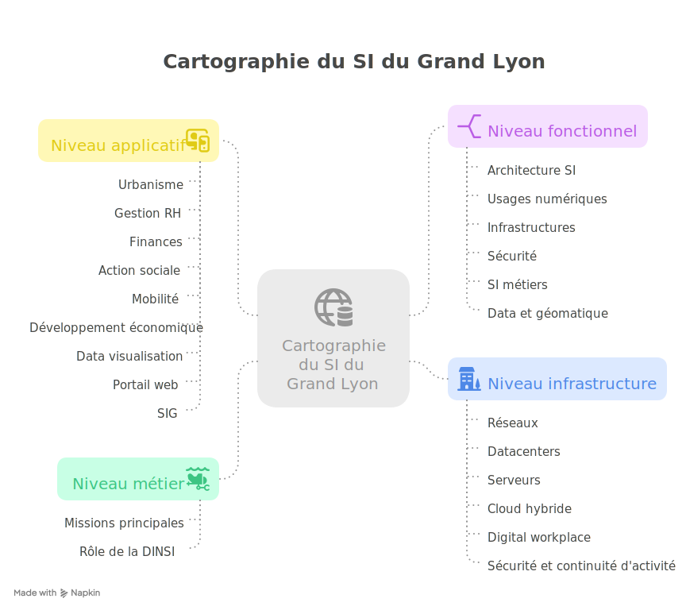

# Dossier Professionnel

## I. Présentation de l'environnement de travail

### A. Présentation de l'entreprise

#### 1. Le groupe Econocom : acteur majeur de la transformation numérique

**Econocom** est un groupe européen majeur du numérique fondé en 1974 par Jean-Louis Bouchard (sous le nom « Europe Computer Systèmes »). Spécialisé dans les services liés à la transformation numérique, il s'est développé autour d'un modèle original couvrant l'équipement IT, les services et le financement associés. Cotée en bourse, l'entreprise se présente comme « **la première entreprise générale du digital en Europe** », capable de prendre en charge l'ensemble de la chaîne de valeur d'un projet numérique (matériel informatique, prestations de service et financement).

Aujourd'hui Econocom revendique environ **2,7 milliards d'euros de chiffre d'affaires** (2024) et **8 450 collaborateurs** dans le monde, avec un réseau présent dans **16 pays**. Le groupe intervient dans de nombreux secteurs d'activité (éducation, santé, industrie, distribution, énergie, etc.), ce qui lui confère un positionnement transversal sur le marché du numérique et de l'informatique d'entreprise. En France, par exemple, Econocom est reconnu comme **1er infogéreur d'environnements utilisateurs** en 2022, mobilisant quelque 5 600 salariés dédiés aux services IT, ce qui illustre sa taille et son importance sur le segment des services numériques.

#### 2. L'agence Econocom de Lyon-Villeurbanne

Au sein de ce groupe, l'**agence Lyon** (basée à Villeurbanne) joue le rôle d'antenne régionale. Elle dessert le bassin d'entreprises et d'administrations de la métropole lyonnaise, en relais des orientations nationales du groupe. Selon le site officiel, l'adresse de cette agence est « **13 bis avenue Albert Einstein, 69100 Villeurbanne** », témoignant de son ancrage local. Cette filiale régionale fait donc partie du maillage territorial d'Econocom en France, permettant au groupe de maintenir une proximité de service et de conseil auprès de ses clients. Elle opère dans la continuité des activités du groupe, en appliquant localement la stratégie nationale de transformation digitale et en apportant des solutions adaptées aux enjeux des entreprises régionales.

#### 3. Environnement technologique et domaines d'intervention

L'agence de Villeurbanne s'inscrit dans l'écosystème technologique d'Econocom, caractérisé par un vaste panel d'expertises IT. La documentation d'Econocom détaille **quatre grands domaines d'intervention principaux** :

- **Environnements utilisateurs (Digital Workplace)** : gestion et support du parc informatique des utilisateurs finaux (postes de travail, mobilité, assistances bureautique), afin d'assurer une expérience intégrée et fluide.

- **Cloud et Infrastructures hybrides** : conception, déploiement et exploitation d'infrastructures IT modernes, incluant les solutions cloud (privé, public et hybrides), les datacenters et la mise en réseau.

- **Applications et données** : modernisation des applications métier, développement de nouvelles solutions logicielles et valorisation des données (big data, BI, IA), afin d'accélérer la transformation numérique des processus.

- **Cybersécurité** : mise en place de dispositifs de sécurité et de conformité pour anticiper les risques et protéger les systèmes d'information et les données sensibles contre les menaces (audit, pare-feu, SOC, etc.).

Ces domaines reflètent l'offre de services d'Econocom : l'agence lyonnaise de Villeurbanne assure à la fois l'**infogérance** (support et maintenance du système d'information), la **gestion de parc** (asset management), ainsi que des projets de migration vers le cloud et de renforcement de la sécurité. Par exemple, Econocom se positionne comme un leader dans l'infogérance des environnements utilisateurs en France, ce qui signifie que le site de Villeurbanne est très probablement engagé dans des missions de support utilisateurs, de déploiement de postes et de maintenance du parc informatique.

#### 4. Enjeux SI et technologiques du site de Villeurbanne

Le site de Villeurbanne doit relever plusieurs enjeux typiques de la transformation digitale actuelle :

- **Modernisation des systèmes d'information** et du parc informatique : transition vers des environnements hybrides (intégration de cloud public/privé), déploiement de solutions de productivité mobiles et distantes, et optimisation de l'infrastructure réseau pour garantir performance et fiabilité.

- **Cybersécurité** : mise en œuvre des bonnes pratiques et outils de protection (gestion des accès, cryptage, supervision continue) pour sécuriser les infrastructures, d'autant plus qu'Econocom met l'accent sur la sécurité dans ses offres.

- **Numérique responsable** : le groupe affiche un engagement fort en matière de numérique responsable et se présente comme "**pionnier de l'économie circulaire du numérique**" avec une démarche de réduction de son empreinte carbone. Concrètement, cela se traduit par la gestion durable du cycle de vie des équipements (réemploi, reconditionnement, recyclage) et l'optimisation énergétique des data centers.

- **Mobilité et agilité du travail** : avec l'essor du télétravail et des nouveaux usages, le site accompagne les clients dans le déploiement de solutions collaboratives sécurisées (VPN, accès distant, collaboration cloud) et dans l'évolution vers des modes de travail plus flexibles.

#### 5. Organisation interne et missions

Au sein de l'agence Econocom de Lyon (Villeurbanne), l'organisation interne se structure généralement autour de plusieurs pôles : un **pôle commercial** (avant-vente et gestion de comptes clients), un **pôle support/maintenance** (techniques et exploitations), et un **pôle administratif**. La section « Témoignages collaborateurs » du site groupe illustre la diversité des profils présents à Lyon – on y retrouve par exemple des techniciens de support (« gestionnaire SAV Helpdesk ») et un responsable d'exploitation (« manager des services Surveillance et Exploitation »).

Parfait, ta partie **Présentation de l’entreprise** est déjà très solide 👌

Pour l’enrichir avec ton **client Grand Lyon** et la **cartographie de son SI**, je te propose d’ajouter une sous-section spécifique après ton point 5 « Organisation interne et missions ». Cela montrera bien que, dans le cadre d’Econocom Villeurbanne, tu as été intégré à une équipe en charge d’un client stratégique, et que tu maîtrises son contexte. Voici un texte que tu pourrais insérer :

#### 6. Le client Grand Lyon et son système d’information

Dans le cadre de mon expérience au sein d’Econocom Villeurbanne, j’ai intégré l’équipe en charge de la gestion du système d’information du **Grand Lyon**, l’un des clients majeurs de l’agence. Le Grand Lyon, ou Métropole de Lyon, est une collectivité territoriale singulière en France : elle exerce à la fois les compétences d’une communauté urbaine et celles d’un département, au service de plus de **1,4 million d’habitants** répartis sur 59 communes. Ses missions sont très diversifiées : aménagement urbain, mobilité et transports, logement et urbanisme, développement économique, solidarité et santé publique, environnement et transition écologique, culture, ainsi que les services numériques aux citoyens.

Pour soutenir ces politiques publiques, la Métropole s’appuie sur une **Direction de l’Innovation Numérique et des Systèmes d’Information (DINSI)**, qui constitue la cheville ouvrière du système d’information métropolitain. L’organigramme de la DINSI met en évidence une organisation structurée autour de plusieurs grands pôles :

* **Pôle Architecture et Urbanisation du SI**, chargé de définir les normes, référentiels et principes d’urbanisation.
* **Pôle Usages numériques**, qui développe et maintient les applications métiers, les portails citoyens et les services digitaux.
* **Pôle Données et Géomatique**, spécialisé dans la gestion et la valorisation des données territoriales (statistiques, cartographie SIG, open data).
* **Pôle Infrastructures et Réseaux**, garant de l’exploitation des datacenters, de la connectivité et des services cloud.
* **Pôle Sécurité des Systèmes d’Information**, qui veille à la conformité, à la résilience et à la cybersécurité du patrimoine numérique.
* **Pôle Support et Digital Workplace**, en charge des environnements utilisateurs (postes de travail, outils collaboratifs, mobilité).

Cette organisation illustre bien la cartographie du SI du Grand Lyon, qui peut être décrite selon les quatre niveaux classiques :

* **Niveau métier** : répondre aux besoins des politiques publiques métropolitaines (mobilité, urbanisme, solidarité, environnement, économie).
* **Niveau fonctionnel** : structurer les grands domaines de services (applications métiers, infrastructures, données, sécurité, support utilisateurs).
* **Niveau applicatif** : gérer un patrimoine applicatif riche, incluant les logiciels de gestion financière et RH, les outils d’urbanisme et de mobilité, les portails citoyens, les systèmes d’information géographique (SIG), et des plateformes de données décisionnelles.
* **Niveau infrastructure** : exploiter des datacenters hybrides, des réseaux sécurisés interconnectant les sites métropolitains, des environnements cloud, ainsi qu’un parc utilisateurs de plusieurs milliers de postes, assorti de mécanismes de supervision, de sauvegarde et de continuité d’activité.

Travailler dans ce contexte a constitué une expérience particulièrement formatrice. D’une part, cela m’a permis de comprendre la complexité d’un SI de grande collectivité, marqué par la diversité des métiers et la multiplicité des applications. D’autre part, cela m’a confronté à des enjeux stratégiques majeurs : **interopérabilité des systèmes, gouvernance des données, cybersécurité, Green IT, continuité des services publics**. L’équipe Econocom, intégrée dans ce dispositif, joue un rôle de partenaire clé en accompagnant la DINSI dans l’exploitation, la sécurisation et l’évolution de son système d’information.

#### 7. IA de floutage pour le projet Nestor

##### 1.1 Objectifs du projet

Ce projet de preuve de concept (POC) a été réalisé dans le cadre de ma mission au sein d’Econocom Villeurbanne, prestataire de services numériques, pour le compte de son client la Métropole de Lyon (Grand Lyon). Ce dernier constitue une collectivité territoriale majeure en France, regroupant 59 communes et plus de 1,4 million d’habitants. Sa Direction de l’Innovation Numérique et des Systèmes d’Information (DINSI) pilote un système d’information complexe destiné à accompagner de multiples missions : urbanisme, mobilité, action sociale, environnement, développement économique et services aux citoyens.
Dans ce contexte, la Métropole est confrontée à des besoins croissants en matière de protection des données personnelles et de conformité réglementaire (RGPD, droit à l’image). La gestion de photos et de vidéos issues de dispositifs urbains (événements publics, transport, aménagement) pose en effet la question de l’anonymisation des visages et des plaques d’immatriculation avant diffusion ou exploitation.

Le projet **Nestor IA – POC Floutage** a pour vocation de démontrer la faisabilité d'un **système de floutage automatique d'images** par intelligence artificielle. Il s'agit d'une *preuve de concept* visant à **détecter puis flouter** des éléments sensibles sur des images, en particulier les *visages humains* et les *plaques d'immatriculation*, de manière entièrement automatisée. L'outil répond à un besoin de **protection de la vie privée** et de *conformité réglementaire* (par exemple, anonymisation de personnes ou de données visuelles dans des photos/vidéos). Ce POC s'inscrit dans un contexte d'**évaluation technologique** : il permet de comparer **deux approches techniques** (une implémentation en *Python* et une en *.NET*) pour intégrer cette fonctionnalité, afin d'orienter les choix futurs selon les performances et la facilité d'intégration dans le système d'information cible.

##### 1.2 Fonctionnalités principales

- **Chargement et traitement d'images**

L'**application Web** permet à l'utilisateur de téléverser une image (photo de personnes, de véhicules, etc.) via une *interface conviviale*.

- **Détection des zones sensibles**

Une fois l'image envoyée, le système identifie automatiquement les **zones d'intérêt à traiter** – typiquement les *visages humains* présents et/ou les *plaques d'immatriculation* des véhicules sur l'image. Ces éléments sont repérés grâce à des **modèles de détection entraînés** (modèles de type **YOLO** spécialisés pour les visages et pour les plaques).

- **Floutage automatique**

Après détection, l'application peut appliquer un **floutage** sur les zones sensibles identifiées (visages, plaques). L'image renvoyée à l'utilisateur comporte donc ces régions floutées, masquant les *informations d'identité* ou d'*immatriculation*.

- **Mode détection vs floutage**

Selon la configuration ou le besoin, le système peut soit fournir un résultat avec **floutage** (image anonymisée), soit simplement remonter les *informations de détection* (par exemple pour afficher des cadres ou indiquer les positions des visages/plaque sans altérer l'image originale). Cela permet de valider l'**étape de détection** indépendamment du floutage.

- **Interface de visualisation**

Le client web affiche le **résultat** (image floutée ou annotée) à l'écran. Des indicateurs peuvent également être présentés pour analyse, par exemple le *temps de traitement* de l'image ou le *nombre d'objets détectés*. L'interface est conçue pour être **simple d'utilisation** afin de servir de démonstrateur de la solution.

- **Support multi-backend (Python / .NET)**

Le POC offre **deux implémentations back-end interchangeables** (une en *Python* et une en *C#/.NET*) sans changer le fonctionnement côté utilisateur. L'application web interagit de la même façon avec l'un ou l'autre service. Cela permet de tester les deux technologies offrant les mêmes fonctionnalités de floutage, et de **comparer leur performance** et comportement dans des conditions identiques.

##### 1.3 Architecture technique

- **Frontend web (Next.js)**

L'interface utilisateur est une **application web** développée avec **Next.js** (framework React en Node.js/TypeScript). Elle sert une page web permettant de charger des images et d'afficher les résultats. Le front-end envoie les images aux services back-end via des **appels HTTP** (API REST) et attend en réponse soit l'image traitée soit les données de détection. L'application Next.js est contenue dans le répertoire `apps/client` du projet (*monorepo*) et peut être démarrée en mode développement via **Yarn**.

- **Backend Python (Flask)**

Un service **RESTful Flask** en Python 3 est dédié au traitement des images côté serveur. Il charge des **modèles de détection** de type YOLO (à l'aide de la bibliothèque *Ultralytics YOLOv8/PyTorch*) pour repérer les visages et plaques sur l'image entrante. Une fois les objets détectés, le service utilise des bibliothèques d'édition d'images (telles que **OpenCV** et **Pillow**) pour appliquer un *flou gaussien* sur les zones ciblées. Le service Flask expose notamment une route API (par exemple `/predict`) qui reçoit une image (uploadée en JSON ou en form-data) et retourne l'image modifiée. Ce composant back-end est situé dans `services/blur-service-flask/` et peut être lancé via la commande `yarn dev:flask` (qui démarre simultanément le serveur Flask et le client Next.js en développement).

- **Backend .NET (C#)**

En parallèle, le projet comporte un **service web en .NET** (C#) offrant les mêmes fonctionnalités de détection/floutage côté serveur. Il s'agit d'une API construite avec **ASP.NET Core** (ciblant .NET 7/8+). Ce service exploite les modèles de détection convertis au format **ONNX** pour repérer visages et plaques. L'inférence est réalisée via **ONNX Runtime** (permettant d'exécuter les modèles de deep learning entraînés en Python dans l'environnement .NET, y compris avec *accélération GPU* si disponible). Pour le floutage, la manipulation de l'image se fait à l'aide de bibliothèques graphiques côté .NET, notamment **SkiaSharp** (ou SixLabors ImageSharp) pour charger l'image et appliquer un filtre de flou sur les pixels concernés. L'API .NET expose des contrôleurs REST (par exemple un contrôleur `/Detect` pour obtenir les coordonnées des objets détectés, et un contrôleur `/Predict` pour retourner l'image floutée). Ce service se trouve dans `services/blur-service-dotnet/` et se lance via `yarn dev:dotnet` (qui démarre le serveur .NET en parallèle du front-end).

- **Conversion des modèles (export ONNX)**

Pour unifier l'usage des **modèles d'IA** entre les deux backends, le projet inclut un module d'export de modèles. Les modèles de détection entraînés (initialement au format *PyTorch .pt*) sont exportés en format **ONNX** grâce à un script Python. Ce module est organisé dans `packages/models-onnx-export/` et un script TypeScript (`scripts/modelExportOnnx.ts`) permet de déclencher l'export facilement (commande Yarn dédiée). Ainsi, le même modèle de détection (par ex. le modèle de visage) peut être utilisé par le service .NET une fois converti, garantissant la **cohérence des résultats** entre l'implémentation Python et C#.

- **Structure du projet (monorepo)**

L'architecture du code est organisée sous forme de **monorepo** géré par *Yarn Workspaces*. À la racine, on retrouve notamment: un fichier de configuration global `nestor-ai-config.json` (contenant les paramètres comme le chemin des modèles, les noms de fichiers de modèle pour le visage et la plaque, le type de tâche – détection ou floutage – à effectuer, etc.), un dossier `services/` (qui contient chaque microservice backend séparément, pour Flask et pour .NET), un dossier `apps/` (contenant l'application cliente Next.js), et un dossier `scripts/` (contenant des utilitaires en TypeScript pour automatiser certaines actions de développement). Cette organisation *modulaire* facilite le développement simultané des différentes composantes et le partage de configurations communes.

- **Scripts et pipeline de développement**

Plusieurs **scripts Yarn/TypeScript** contribuent à automatiser le workflow technique. Par exemple, `yarn setup` exécute un script qui crée et configure l'*environnement virtuel Python* (`.venv`) et installe les dépendances nécessaires au service Flask. D'autres scripts (`serviceFlask.ts`, `serviceDotnet.ts`) permettent de lancer le backend Flask ou .NET accompagné du client web, et de surveiller les modifications de code. Le **pipeline d'exécution** typique consiste à choisir le backend désiré (Python ou .NET), exporter les modèles en ONNX si on utilise .NET, puis démarrer le service choisi en parallèle du front-end. En environnement de développement, le front-end interagit en local avec le backend sélectionné sur les endpoints API prévus. Des *hooks git* (via **Husky**) et des outils de lint/format (**Prettier**, **Black**, etc.) sont également configurés pour assurer la qualité et la cohérence du code sur l'ensemble du projet.

- **Processus de traitement d'une image (workflow)**

Quel que soit le backend utilisé, le **déroulement** est similaire. L'utilisateur charge une image via l'interface Next.js, celle-ci est envoyée au serveur (Flask ou .NET) via une *requête API*. Le serveur charge les **modèles de détection** de visage et de plaque (dont les chemins sont définis dans la config), puis exécute une *inference* pour trouver les coordonnées des zones à flouter. Une fois les zones identifiées, le serveur applique un **floutage** sur ces régions de l'image – en pratique un *flou pixelisé* ou *gaussien* est appliqué aux rectangles englobant les visages et/ou plaques détectés. L'image résultante est ensuite renvoyée au front-end, qui l'affiche à l'écran pour l'utilisateur. Ce **workflow complet** – de la soumission de l'image au retour de l'image floutée – illustre la chaîne de traitement mise en place par le POC.

### B. Description des projets MSPR

#### 1. Analyse des données électorales

#### 1.1 Objectifs du projet

Le projet **analyse\_data\_election** a pour vocation de développer un **système complet d’analyse et de visualisation des données électorales françaises**. Son ambition est de transformer des données brutes issues de sources publiques (Ministère de l’Intérieur, INSEE, etc.) en **informations exploitables** pour divers acteurs : journalistes, analystes politiques, citoyens ou encore chercheurs.

Le département du Rhône a servi de **terrain d’expérimentation**. Sa diversité socio-économique, son poids politique régional et la disponibilité de données précises en font un échantillon représentatif. L’objectif est de dégager des **corrélations significatives** entre facteurs démographiques (âge, niveau d’éducation, défavorisation, pouvoir d’achat) et comportements électoraux (vote, abstention, participation).

Enfin, le projet vise également à explorer des **approches prédictives** grâce aux réseaux de neurones artificiels. Ces modèles permettent de prédire les résultats futurs en fonction des tendances observées, tout en respectant les contraintes éthiques et légales liées au **RGPD** (anonymisation, conservation limitée, usage strictement analytique).

#### 1.2 Fonctionnalités principales

Le système offre un ensemble de fonctionnalités répondant aux besoins d’analyse exploratoire et décisionnelle :

- **Collecte et intégration des données électorales**

  Un pipeline **ETL** (Extract, Transform, Load) assure l’importation, le nettoyage et la fusion des données électorales avec des indicateurs socio-économiques. Les jeux de données sont harmonisés pour permettre des analyses multi-échelles (commune, département, région).

- **Analyse comparative multi-élections**

  L’application permet de comparer les résultats entre différents scrutins (présidentielles, législatives, municipales, européennes) et de suivre l’évolution temporelle des comportements électoraux.

- **Visualisation géographique interactive**

  Les résultats électoraux sont représentés sous forme de **cartes dynamiques**. Les communes ou départements sont colorés selon les scores ou les taux de participation, ce qui rend immédiatement visible l’implantation territoriale des partis ou l’abstention.

- **Tableaux de bord dynamiques**

  Des dashboards interactifs permettent de croiser plusieurs indicateurs via des graphiques (courbes, barres, heatmaps). L’utilisateur peut filtrer par âge, éducation ou pouvoir d’achat pour mieux comprendre les facteurs influençant le vote.

- **Analyse prédictive et modélisation**

  Un **réseau de neurones artificiels** a été implémenté pour réaliser deux types de tâches :

  - **Classification** : prédire le candidat vainqueur dans une commune.
  - **Régression** : estimer les pourcentages obtenus par chaque candidat.
    Le modèle, flexible et ajustable (hyperparamètres, couches), atteint une précision de **0,83** sur les données test, démontrant sa fiabilité.

- **Export et partage**

  Les résultats d’analyses peuvent être exportés en **PDF, Excel ou images** afin de faciliter leur réutilisation et diffusion.

- **Respect du RGPD**

  Le système applique les principes de protection des données : anonymisation, usage limité à l’analyse, conservation restreinte et sécurisation.

#### 1.3 Architecture technique

Le projet repose sur une architecture modulaire pensée pour la **scalabilité et la reproductibilité** :

- **Backend de traitement de données (Python)**

  Le cœur du système utilise **Pandas** pour la manipulation des données, **NumPy** pour les calculs numériques et **Scikit-learn / TensorFlow-Keras** pour l’entraînement des modèles de machine learning.

- **Base de données et stockage**

  Les données électorales sont structurées dans une **base relationnelle** (PostgreSQL ou SQLite) avec indexation optimisée. Un **data warehouse simplifié** permet l’historisation et l’agrégation multi-élections.

- **Framework de visualisation**

  L’interface est construite avec **Dash** ou **Streamlit**, combinant des visualisations interactives (Plotly, Matplotlib) et des cartes (Geopandas, Folium).

- **API REST et services web**

  Les analyses sont exposées via une **API RESTful**. Les endpoints permettent de requêter les résultats électoraux, d’obtenir des visualisations ou de lancer une prédiction.

- **Pipeline ETL automatisé**

  Les données sont rafraîchies périodiquement grâce à des scripts Python intégrés au pipeline. Chaque mise à jour inclut un processus de validation et de contrôle qualité.

- **Interface utilisateur responsive**

  Le frontend est conçu pour être utilisable aussi bien sur **desktop que mobile**, afin de rendre l’exploration accessible au plus grand nombre.

- **Sécurité et performance**

  Le système implémente une **authentification sécurisée**, une gestion des autorisations et des optimisations (cache, pagination, compression) pour garantir des temps de réponse rapides, même avec de gros volumes de données.

#### 2. Optimisation et amélioration du Système d'Information de K-ElectroniK

##### 2.1 Objectifs du projet

Nous avons entrepris un projet visant à **optimiser et moderniser** le Système d'Information (SI) existant de **K-ElectroniK**, une PME française en pleine *expansion internationale*. L'entreprise fait face à plusieurs enjeux simultanés : l'intégration d'une **filiale espagnole** récemment acquise, la nécessité de remplacer ou mettre à jour des *outils numériques vieillissants*, le renforcement de la **sécurité informatique** et de la *gouvernance du SI*, ainsi que la prise en compte des exigences de **responsabilité sociétale** (Green IT/RSE). Dans ce contexte, un **plan de transformation du SI** a été validé par la direction, et notre équipe a été mandatée pour réaliser un *diagnostic complet* de l'existant, proposer des **améliorations concrètes** et accompagner K-ElectroniK vers une meilleure *maturité numérique*, en alignant les évolutions du SI sur la **stratégie globale** de l'entreprise. L'objectif final du projet est donc de doter K-ElectroniK d'un **SI unifié, fiable et évolutif**, capable de soutenir sa croissance et d'améliorer son *efficacité opérationnelle* tout en réduisant les risques (pannes, failles de sécurité) et en répondant aux nouvelles attentes des clients et partenaires.

##### 2.2 Fonctionnalités principales

Pour répondre aux besoins métiers recensés et aux problèmes identifiés, nous avons défini les **fonctionnalités clés** que le nouveau SI ou les évolutions apportées doivent offrir :

- **CRM unifié et marketing intégré**

Déploiement complet de l'outil de gestion de la relation client **FreshSales** sur l'ensemble du groupe (France et Espagne), afin d'exploiter tous ses modules (notamment les *campagnes marketing*) et d'unifier la gestion des clients et prospects. Cette évolution permet de **centraliser les informations client** et de mener des campagnes marketing ciblées depuis une plateforme commune.

- **Gestion de production modernisée**

Refonte complète du **logiciel de gestion de production** interne (l'outil historique datant de 2005) par une solution moderne. Le nouveau module prendra en charge la *planification de la production*, la *gestion des stocks* et le *suivi des personnalisations produits*, afin de remplacer l'ancien système obsolète et de **gagner en efficacité**.

- **Renforcement de la sécurité et continuité d'activité**

Mise en place d'une **Politique de Sécurité des Systèmes d'Information (PSSI)** formalisée, accompagnée de plans de reprise et de continuité d'activité (**PRA/PCA**). Concrètement, nous prévoyons l'*authentification multi-facteur (MFA)* sur les accès sensibles, la *sauvegarde automatisée* et externalisée des données critiques, et l'application des bonnes pratiques issues de la **norme ISO 27002** afin de structurer la sécurité du SI. Ces mesures visent à protéger les informations de l'entreprise et à assurer la **disponibilité du SI** même en cas d'incident majeur.

- **Fusion et unification des systèmes France/Espagne**

Intégration de l'infrastructure et des applications de la **filiale espagnole** avec celles du siège français. L'objectif est d'harmoniser les outils et pratiques informatiques entre les deux entités (par exemple en déployant le même *ERP, CRM* et autres logiciels dans les deux pays) afin de supprimer les silos et de réduire la **dette technique** accumulée historiquement. À terme, cela permettra un *pilotage centralisé* du SI du groupe et des **données unifiées** au niveau européen.

- **Portail de services IT (ITSM)**

Mise en œuvre d'un **portail centralisé** pour le support informatique interne, basé sur un outil d'*IT Service Management* (tel que **GLPI** ou **Jira Service Management**). Ce portail permettra aux employés de formuler des demandes ou de signaler des incidents via un *système de tickets*, ce qui améliore le support en centralisant et en suivant les demandes, et formalise les **engagements de service (SLA)** du côté de la DSI. L'adoption d'un tel module accroît la *traçabilité* des demandes et contribue à réduire les délais de résolution grâce à une meilleure priorisation.

- **Initiatives "Green IT" et RSE**

Introduction de pratiques d'**informatique responsable** afin de minimiser l'*empreinte carbone* du SI (par exemple en optimisant la consommation énergétique des serveurs et en allongeant le cycle de vie du matériel). Nous proposons également de suivre des **indicateurs RSE** liés au numérique (*bilan carbone du SI, taux de recyclage du matériel*, etc.) et de sensibiliser les utilisateurs aux *éco-gestes numériques*. Ces fonctionnalités transverses visent à aligner le SI sur les valeurs de **développement durable** de l'entreprise et à répondre aux attentes croissantes des clients en la matière.

##### 2.3 Architecture technique

D'un point de vue technique, l'architecture du SI de K-ElectroniK évolue d'un **environnement hétérogène** vers une infrastructure *unifiée, moderne et sécurisée*. À l'état initial, le SI comportait un **mélange disparate** de technologies et d'applications : certaines fonctions critiques reposent sur des outils développés en interne il y a plus de 10 ans (ex : un logiciel maison *"GestComs"* pour les achats, un programme sur mesure de 2005 pour piloter la production), tandis que d'autres s'appuient sur des **solutions du marché** plus récentes (par ex. **SmartRH** en SaaS pour la gestion RH, **Cegid** pour la comptabilité/finance, **FreshSales CRM** utilisé de façon partielle pour le suivi commercial, ou encore **PrestaShop** pour le site e-commerce).

Dans le cadre du projet, nous préconisons de **rationaliser et moderniser** l'architecture logicielle. Le remplacement de l'outil de production obsolète sera l'occasion d'adopter une **architecture applicative moderne**, par exemple une *application web multi-couches* (front-end, API, base de données) afin d'en faciliter la maintenance et l'intégration avec les autres systèmes. Les nouvelles solutions seront choisies en privilégiant l'**interopérabilité** : des interfaces (**API** ou connecteurs) permettront la communication entre le CRM, l'ERP et le site e-commerce, afin d'éliminer les ressaisies et les *silos de données*. Par ailleurs, pour améliorer le support aux utilisateurs, nous allons déployer un **portail ITSM** basé sur une solution open-source éprouvée (type **GLPI**), ce qui structurera la gestion des incidents/demandes et en améliorera la traçabilité.

Sur le plan de l'infrastructure, nous recommandons l'**unification du réseau** entre les sites de Paris et Madrid (*annuaire et authentification centralisés*) et la mise en place de mécanismes robustes de **sécurité et sauvegarde**. Concrètement, cela inclut l'activation d'une *authentification forte (MFA)* sur l'ensemble des applications critiques, la mise en place de **sauvegardes automatiques externalisées** (en cloud) et d'un **Plan de Reprise d'Activité** documenté et testé régulièrement. Ces mesures augmenteront la *résilience* du système en cas de sinistre et assureront la disponibilité des services clés.

Enfin, l'architecture cible intègre des **outils de supervision** et de pilotage du SI, afin de mesurer la performance et d'appuyer la *gouvernance technique*. Nous prévoyons par exemple de déployer des **tableaux de bord dynamiques** (via des solutions telles que **Microsoft Power BI** ou **Grafana**) permettant de visualiser en temps réel les indicateurs du SI (*état des serveurs, tickets en cours, niveaux de service*, etc.). Ces tableaux de bord offriront un **pilotage réactif** du SI, en aidant l'équipe informatique à détecter proactivement les anomalies et à justifier des ressources ou investissements sur des données objectives. L'ensemble du code, des configurations et des documents produits sera géré de façon professionnelle (*gestion de version, documentation technique, segmentation en modules clairs*) afin de faciliter la maintenance et les futures évolutions du système. Ce **socle technique modernisé** permettra à K-ElectroniK de disposer d'un SI *agile, sécurisé* et aligné sur ses processus métier, tout en étant préparé pour les défis à venir.

#### 3. Projet Cofrap

##### 3.1 Contexte et finalité générale

**Cofrap** (Compagnie Française de Réalisation d'Applicatifs Professionnels) est une entreprise spécialisée dans les **solutions logicielles de gestion d'entreprise**, concurrente de COGIP sur les *ERP et applications web métier*. Face à la croissance de sa base d'utilisateurs et à des **compromissions récurrentes de comptes cloud** (liées à des mots de passe faibles et à la non-adoption de la 2FA), Cofrap a décidé de **moderniser son processus d'inscription et d'authentification**. L'objectif est de mettre en place une **infrastructure cloud-native et serverless** (sur Kubernetes) assurant la génération sécurisée de mots de passe complexes, l'activation systématique de la *double authentification (2FA TOTP)* et la distribution des identifiants via **QR codes**. Ce projet (PoC) vise ainsi à **automatiser et centraliser** la gestion des comptes utilisateurs tout en répondant aux exigences de **sécurité, de performance et de scalabilité** de Cofrap.

##### 3.2 Objectifs du projet

- **Sécurité renforcée**

Éliminer les risques liés aux **mots de passe faibles** en imposant une génération automatique de mots de passe complexes.

- **Authentification forte**

Rendre obligatoire l'usage d'une **double authentification TOTP** pour tous les comptes.

- **Distribution simplifiée**

Fournir aux utilisateurs des **identifiants** (login, mot de passe, secret 2FA) via des *QR codes à usage unique*, pour simplifier l'enregistrement.

- **Cycle de vie maîtrisé**

Définir une **validité limitée** des identifiants (6 mois), avec un mécanisme de *renouvellement automatique* des comptes expirés.

- **Interface utilisateur**

Offrir une **interface simple** permettant de créer un compte utilisateur (si inexistant), de s'authentifier (login + mot de passe + code TOTP) et de déclencher automatiquement la *remise à zéro* des identifiants expirés.

Ces objectifs métier s'inscrivent dans les enjeux de Cofrap : renforcer la **sécurité des accès cloud**, réduire les *coûts de support* en automatisant la gestion des comptes, et optimiser les ressources techniques via une architecture **serverless (OpenFaaS)** *"scale-to-zero"*.

##### 3.3 Fonctionnalités principales

- **Création de compte sécurisé**

Génération automatique d'un **mot de passe de 24 caractères** (avec majuscules, minuscules, chiffres, caractères spéciaux) et d'un *secret TOTP chiffrés*, stockés en base.

- **Génération de QR codes**

Création de **QR codes à usage unique** contenant les identifiants (mot de passe et clé 2FA) pour simplifier la transmission et l'enregistrement côté utilisateur.

- **Double authentification**

Activation obligatoire de l'**authentification TOTP** à chaque connexion, avec vérification du code et de la validité de l'identifiant par une *fonction serverless*.

- **Gestion du cycle de vie**

**Expiration des identifiants** au bout de 6 mois et relance automatique du processus de création si un utilisateur tente de s'authentifier avec des identifiants périmés.

- **Interface front-end simple**

Pages web (création de compte, affichage du QR code, formulaire de connexion) permettant à l'utilisateur de déclencher les **appels API** adéquats (via *OpenFaaS Gateway*).

##### 3.4 Architecture technique

- **Frontend**

Application web en **React/HTML** (monopage) servant d'interface utilisateur. Le front-end communique avec les fonctions backend via des **requêtes HTTP REST** (*OpenFaaS Gateway, faas-netes*).

- **Backend (serverless OpenFaaS)**

**Fonctions** écrites en **Node.js** déployées sur *OpenFaaS*. Chaque fonction gère une tâche métier (génération de mot de passe, génération de secret 2FA, vérification d'authentification, etc.). Le choix de Node.js facilite l'intégration de bibliothèques JavaScript pour le *chiffrement*, la *gestion TOTP* et la création de *QR codes*. OpenFaaS a été déployé dans un **cluster Kubernetes** (via Helm charts) pour exécuter ces fonctions de manière évolutive.

- **Base de données**

**MongoDB** (ou équivalent NoSQL) pour stocker les comptes utilisateur (login, mot de passe chiffré, secret 2FA, dates d'expiration). L'utilisation de Node.js s'intègre naturellement avec MongoDB pour le stockage des *secrets* et des *logs d'authentification*.

- **Orchestration/déploiement**

**Cluster Kubernetes local** (K3s sous OrbStack) pour déployer tous les composants (OpenFaaS, services, base de données, Traefik/MétalLB). Le déploiement a été automatisé avec **Helm** et la CLI OpenFaaS (*faas-cli*) pour assurer un provisionnement reproductible. Le **pipeline CI/CD** repose sur Docker et *GitHub Actions/GitHub* pour builder les images de fonctions et les déployer dans le cluster. La gestion des secrets est assurée par la combinaison de *faas-secrets* et des objets **Secret Kubernetes**.

- **Flux de données utilisateurs**

**Création de compte** : l'utilisateur remplit le formulaire front-end (login souhaité). Le front appelle une fonction OpenFaaS (ex. `/function/create-account`) qui génère le mot de passe complexe et le secret 2FA, les chiffre et les stocke en base, puis retourne un *QR code* à l'application. Le frontend affiche le QR code pour que l'utilisateur le scanne et enregistre ses identifiants.

**Authentification** : l'utilisateur soumet son login, mot de passe et code TOTP au front, qui appelle la fonction d'authentification. Celle-ci vérifie le mot de passe, le code 2FA et la date d'expiration du compte. Si l'utilisateur est expiré, elle renvoie un statut *« compte expiré »*, déclenchant automatiquement le front à redéclencher la création de compte (renouvellement des identifiants).

##### 3.5 Méthodologie de travail

Le projet a été mené en mode **agile**, avec un découpage itératif en *sprints courts* (1 semaine environ) et des rituels **Scrum** simplifiés. Chaque membre disposait de **rôles définis** (*Scrum Master, Product Owner, développeurs backend/frontend, DevOps, référent qualité/documentation*). Les tâches (*user stories* et tickets) ont été gérées via un **Kanban (Jira)** et un planning de projet (*diagramme de Gantt*). L'équipe a utilisé **GitHub** pour le code (branches, pull requests), ainsi que *Jira/Slack/GitHub* comme tableau Kanban partagé. Des **points quotidiens** (*stand-up*) permettaient de faire le suivi et de réaffecter rapidement les tâches. Les outils numériques incluaient également *Google Meet/Zoom* pour les réunions, *Google Drive/Wiki* pour la documentation, et **Slack** pour la communication asynchrone. Cette organisation agile, alliée aux sprints planifiés et à la répartition claire des responsabilités, a assuré la **traçabilité du projet** et une *livraison progressive* des fonctionnalités.

##### 3.6 Particularités humaines et managériales

Le projet a été réalisé dans un **environnement distancié et multiculturel**. L'équipe a majoritairement travaillé en *télétravail*, maintenant une communication fluide par les **outils collaboratifs** (*Slack, Google Meet, Zoom*) et des rituels réguliers (*daily meetings, revues de sprint*). Étant composée de membres d'horizons culturels variés, l'équipe a choisi l'**anglais technique** comme langue de travail pour garantir l'*inclusion linguistique* et une compréhension commune. L'**accessibilité** a également été prise en compte : l'interface utilisateur a été conçue avec des principes d'accessibilité (*navigation clavier, éléments ARIA, contraste adapté*) pour les personnes à mobilité réduite ou déficientes visuelles. Sur le plan managérial, un **climat de travail bienveillant** a été cultivé, avec un équilibre entre performance et bien-être. L'équipe a veillé à adapter les charges de travail, offrir un cadre flexible et soutenir les membres en cas de blocages, favorisant ainsi la **motivation et la créativité** de chacun.

##### 3.7 Bilan du projet

Au terme du **PoC Cofrap**, l'équipe a nettement progressé techniquement : elle maîtrise désormais le **déploiement Kubernetes** (OrbStack), la *programmation serverless OpenFaaS*, ainsi que le développement **Node.js et MongoDB** dans un contexte *cloud-native*. Les membres ont gagné en **autonomie** (gestion de leur temps, auto-organisation) et développé des *soft skills* en communication et résolution de problèmes. Le projet a démontré la capacité à concevoir une **architecture robuste et modulable**, répondant aux exigences de sécurité (*chiffrement, OTP, QR code*) en environnement professionnel.

Plusieurs **difficultés** ont été rencontrées (prises en main de la CI/CD OpenFaaS, configuration des secrets, déploiement sous K8s local), gérées par des *solutions de repli planifiées* (ex. migration rapide vers Minikube/Docker en cas de problème Kubernetes). La **méthode agile** a permis de réagir aux imprévus (absences ou retards) en réaffectant les tâches critiques et en ajustant le périmètre du sprint.

En termes d'**impact pour l'entreprise**, ce Proof of Concept constitue une *base solide* pour un déploiement ultérieur sur une infrastructure cloud publique ou hybride. Il répond directement au **besoin métier** : sécuriser les accès cloud de Cofrap, automatiser la gestion des identifiants et diminuer les coûts de support. La solution modulaire pourra être étendue (intégration à un SSO, montée en charge, etc.) et prouve que l'équipe possède les **compétences techniques et organisationnelles** attendues d'un expert SI.

## II. Valorisation des compétences

### B. Analyse des compétences par bloc de certification

#### 1. Analyser et définir la stratégie d'un système d'information

##### 1.1 Description des compétences visées

- **Mettre en place une veille technologique**

Nous mettons en place un **dispositif de veille technologique** en français et en anglais, orienté sur les besoins des métiers de l'entreprise. Cette démarche nous permet d'anticiper les *technologies émergentes* comme l'**intelligence artificielle, l'IoT, la robotique** ou encore la **blockchain**. Nous sélectionnons, synthétisons et restituons les résultats de cette veille aux décideurs afin d'orienter la stratégie du SI vers les solutions les plus *prometteuses* et les plus *adaptées* à nos enjeux.

- **Collecter et analyser les besoins métiers**

Nous recueillons et analysons les **besoins exprimés par les directions métiers** pour bâtir le projet de développement du système d'information. Cette collecte s'effectue par des *entretiens, des ateliers de travail* ou l'étude de processus existants. L'objectif est de garantir que l'évolution du SI respecte les **attentes opérationnelles** tout en assurant un *alignement stratégique* avec les orientations globales de l'entreprise.

- **Analyser la stratégie de l'entreprise et diagnostiquer le SI**

Nous analysons la **stratégie générale de l'entreprise** en étudiant son *environnement concurrentiel*, son marché et son mode de fonctionnement. À partir de cette analyse, nous établissons un **diagnostic du système d'information** en place. Ce diagnostic nous permet de mettre en évidence les *forces et les faiblesses* du SI et de mesurer son adéquation avec les **objectifs stratégiques** de l'organisation.

- **Cartographier un système d'information existant**

Nous cartographions le système d'information existant selon ses **quatre niveaux** : *métier, fonctionnel, applicatif et infrastructure*. Cette cartographie détaillée nous apporte une **vision globale et structurée** de l'ensemble des composants du SI. Elle constitue un outil essentiel pour identifier les *points de convergence*, les doublons éventuels et les zones nécessitant une évolution.

- **Identifier les informations sensibles et les risques**

À partir de la cartographie réalisée, nous identifions les **informations sensibles** de l'entreprise ainsi que les *zones critiques* et les chemins d'attaque possibles. Cette analyse nous permet de contribuer à la **politique de sécurité** du SI en fournissant au *Responsable de la Sécurité des Systèmes d'Information (RSSI)* une vision claire des risques et des **priorités de protection**.

- **Élaborer la stratégie informatique**

Nous élaborons la **stratégie informatique** de l'entreprise en prenant en compte ses objectifs, sa stratégie générale et son *schéma directeur*. Nous proposons des projets d'**évolution, d'adaptation ou de migration** du système d'information afin d'accompagner le développement global de l'organisation, tout en répondant aux besoins croissants en *cybersécurité* et en *conformité réglementaire*.

- **Présenter et prioriser les projets SI**

Nous préparons des propositions de projets d'évolution du système d'information que nous présentons au comité de direction. Ces projets sont priorisés afin de s'assurer que les plus stratégiques soient lancés en premier, en cohérence avec la stratégie définie et les capacités budgétaires et organisationnelles de l'entreprise.

- **Définir des indicateurs de performance (KPI)**

Nous définissons des indicateurs clés de performance en nous appuyant sur des méthodes reconnues comme les SLA, ITIL ou encore le TRS. Ces indicateurs alimentent des tableaux de bord qui nous permettent de mesurer la performance du SI, de suivre son évolution et de détecter rapidement des axes d'amélioration.

- **Amélioration continue par le Lean IT**

Nous définissons également des indicateurs de performance opérationnelle en nous appuyant sur les principes du Lean IT. Cette approche nous permet d'identifier les gaspillages, de réduire les coûts informatiques et d'améliorer la satisfaction des utilisateurs en proposant des évolutions concrètes du SI.

- **Intégrer les enjeux Green IT et RSE**

Nous intégrons dans la stratégie du système d'information des indicateurs liés au Green IT et à l'informatique responsable. En évaluant l'empreinte énergétique et carbone de nos infrastructures, nous proposons des pistes d'amélioration continue permettant de réduire l'impact environnemental et d'inscrire l'entreprise dans une démarche RSE plus responsable.

- **Piloter les processus avec le BPM**

Enfin, nous appliquons les composants du Business Process Management (BPM) pour assurer le suivi du système d'information existant. Grâce à des outils de pilotage des flux et de gestion des processus, nous pouvons suivre en continu la réalisation des activités et proposer des améliorations visant à accroître la performance et la fiabilité du SI.

##### 1.2 Mise en œuvre des compétences à travers les projets professionnels

Dans la mise en pratique du **Bloc 1** de la certification RNCP35584, nous nous sommes appuyés principalement sur le projet d'**optimisation du système d'information** (SI) de la PME **K-ElectroniK**, tout en citant également les projets *Cofrap* ou *Nestor IA* à titre illustratif. Ce projet visait à **aligner le SI** sur la stratégie de croissance de K-ElectroniK (par exemple le déploiement international d'un nouveau CRM pour soutenir les ventes). Conformément aux compétences requises, l'**analyse stratégique** a été la première étape. L'objectif était d'« élaborer la stratégie informatique de l'entreprise en analysant les objectifs et la stratégie générale » de K‑ElectroniK pour proposer des **évolutions du SI** en cohérence avec son développement. Cette démarche s'inscrit dans l'**alignement stratégique**, un levier essentiel de la performance d'entreprise : un SI bien aligné « soutient et renforce la performance » et garantit que les *investissements IT* sont en phase avec les **priorités métier**.

- **Diagnostic, cartographie et veille technologique**

Après cette phase stratégique, nous avons réalisé un **diagnostic complet** du SI existant. Celui-ci a débuté par une **cartographie multi-niveaux** (*métier, applicatif, infrastructure*) de l'organisation et de son système d'information. Cette démarche d'*urbanisation du SI* vise à « identifier l'ensemble des éléments du SI » pour disposer d'une **vision globale centralisée**. Nous avons ainsi modélisé les **processus métier clefs** en *BPMN* (par exemple la gestion des campagnes marketing) et représenté les applications et serveurs en **ArchiMate**. Cette base de connaissance du système a permis de mettre en lumière les **forces et faiblesses existantes** (redondances applicatives, obsolescence technique, etc.), comme le souligne Projexion : un diagnostic apporte un *regard extérieur* pour identifier les points forts et les déficiences du SI.

En parallèle, un **dispositif de veille technologique** a été instauré. Nous avons surveillé les *innovations* (**IA, IoT, blockchain**…) pertinentes pour K-ElectroniK et élaboré des **rapports périodiques** à destination du comité de direction. Cette veille a alimenté les **recommandations stratégiques** en proposant, par exemple, l'intégration de solutions émergentes (*chatbots* pour le support client, *automatisation* des entrepôts) afin d'anticiper les besoins futurs de l'entreprise.

- **Sécurité, gestion des risques et PSSI**

La **sécurité du SI** a été traitée à travers une *analyse de risques* formalisée. Sur la base de la cartographie, nous avons listé les **données sensibles**, les *zones critiques* et les *vecteurs d'attaque* potentiels, conformément à l'exigence de la certification d'« identifier les informations sensibles, les risques, [et] les chemins d'attaque » pour aider à définir la **politique de sécurité**. Les résultats ont conduit à l'élaboration d'une **Politique de Sécurité du Système d'Information (PSSI)** pour K‑ElectroniK. La PSSI est le *document de référence* en matière de sécurité : elle « définit les objectifs à atteindre et les moyens accordés pour y parvenir » et repose sur une **analyse préalable des risques**. Pour K‑ElectroniK, elle comporte notamment les *règles de sauvegarde* et de *continuité d'activité* pour les fonctions critiques (finance, production), les **exigences de chiffrement** et *contrôle d'accès*, ainsi qu'un **plan de reprise d'activité** définissant les délais maximal de rétablissement. Cette démarche assure que le SI est sécurisé de manière cohérente avec les enjeux métier et réglementaires (*RGPD, normes ISO 27001/27005*).

- **Indicateurs de performance, Lean IT et Green IT**

Afin d'assurer le **pilotage de la performance** du SI, nous avons défini des **indicateurs clés** sur plusieurs dimensions. D'une part, des *métriques de qualité de service* (**SLA**, taux d'incidents, *TRS* des systèmes critiques) ont été établies et visualisées dans un **tableau de bord ITIL**. Cela permet de suivre en temps réel la *disponibilité des services*, le respect des engagements contractuels et d'identifier rapidement les dérives. D'autre part, inspirés par une approche **Lean IT**, nous avons introduit des **indicateurs opérationnels** axés sur les *coûts* et la *satisfaction utilisateur* (par exemple, le coût total de possession des serveurs et la durée de traitement d'un ticket). Cette démarche a mis en évidence des **leviers d'amélioration** (*streamlining* des processus IT, redimensionnement du parc applicatif) pour réduire les gaspillages et optimiser les ressources. Enfin, dans une perspective de **SI responsable**, des indicateurs **Green IT** ont été intégrés : *consommation énergétique* des data centers, *émissions carbone* du parc informatique, *taux de recyclage* des équipements. Ces **indicateurs RSE** permettent à K‑ElectroniK de mesurer l'impact environnemental de son SI et de mettre en place des *pratiques vertes* (virtualisation des serveurs, politique de recyclage, télétravail) pour limiter l'**empreinte écologique** de son informatique.

- **Gouvernance, méthodologie et livrables**

Le **pilotage du projet** s'est effectué en mode *gouvernance partagée* entre DSI, directions métiers et CODIR. Des **ateliers réguliers** ont réuni le RSSI, les chefs de projet métier (*logistique, finance, marketing*), la DAF et la direction générale pour valider les hypothèses et prioriser les actions. Les **évolutions proposées** (renforcement du CRM, rationalisation applicative, etc.) ont été présentées au comité de direction et priorisées en fonction de leur **alignement stratégique**. Par exemple, la *montée en puissance du CRM* a été considérée prioritaire pour soutenir l'expansion commerciale, tandis que des travaux d'*optimisation d'infrastructure* ont été planifiés après-coup. En termes de méthodologie, nous avons couplé des **approches structurées** (planification en phases avec cahiers des charges fonctionnel et technique) et **agiles** (*sprints itératifs* pour livrer rapidement des améliorations incrémentales) afin de concilier rigueur et flexibilité.

Les **livrables produits** sont variés : rapport d'audit et de diagnostic du SI, *cartographies As-Is/To-Be*, matrices de risques et plan de traitement, canevas de PSSI, cahiers des charges technique et fonctionnel, plan de transformation priorisé, ainsi que **tableaux de bord** de suivi des indicateurs. Les **outils utilisés** ont notamment été : *Archi* et *Sparx EA* pour la modélisation ArchiMate/BPMN, *Excel/Power BI* pour les tableaux de bord, et des plateformes collaboratives (*Jira, Confluence*) pour la gestion du projet et la capitalisation documentaire. Ces livrables et outils ont permis d'impliquer l'ensemble des **parties prenantes** (métier, IT interne et prestataires externes) et de sécuriser la démarche technique et organisationnelle.

- **Apports professionnels et conclusion**

En mobilisant ce large spectre de **compétences du Bloc 1**, j'ai consolidé ma *vision systémique* et *stratégique* du SI. Ce travail a permis à K-ElectroniK d'obtenir une **feuille de route SI cohérente**, sécurisée et durable, contribuant directement à sa performance opérationnelle. Comme le souligne Abraxio, la DSI est un élément clé de la **compétitivité de l'entreprise** : « une entreprise qui n'arrive pas à aligner ses technologies avec ses objectifs stratégiques peut perdre en compétitivité ». À l'inverse, un **alignement réussi** « maximise l'efficacité de l'IT tout en contribuant activement aux objectifs stratégiques ». Grâce à cette expérience, j'ai développé des **méthodes opérationnelles** (*cartographie d'urbanisme, diagnostic systémique, élaboration de PSSI, définition de KPI Lean/Green*) et renforcé ma capacité à dialoguer aux niveaux stratégiques (*CODIR*) comme opérationnels. Ces **apports professionnels** font désormais partie intégrante de ma pratique : je maîtrise la conduite de *diagnostics SI complexes* et la traduction de l'analyse stratégique en **projets technologiques** alignés sur la stratégie de l'entreprise.

#### 2 Manager un projet informatique avec agilité en collaboration avec les parties prenantes

##### 2.1 Description des compétences visées

- **Planifier le projet and allouer les ressources**

Nous planifions l'ensemble des étapes d'un projet en définissant les **livrables attendus** et en répartissant les tâches selon les *compétences disponibles*. Cette organisation rigoureuse nous permet d'anticiper les **besoins humains, techniques et financiers**, de maîtriser les délais et de limiter les *risques de dérive*.

- **Rédiger le cahier des charges and cadrer les besoins**

Nous concevons et rédigeons les **cahiers des charges fonctionnels et techniques** afin de formaliser clairement les besoins métiers. Ces documents, *validés par les parties prenantes*, servent de référence pour guider l'équipe et garantir que les solutions développées répondent aux **attentes exprimées**.

- **Piloter le projet avec les méthodes agiles**

Nous adoptons les **principes et outils agiles** (*Scrum, Kanban*) pour découper le projet en *itérations courtes* et livrer des **incréments réguliers**. Les *sprints, mêlées quotidiennes* et *revues de sprint* nous permettent d'ajuster rapidement le périmètre et de réduire les délais de mise en production tout en favorisant la **satisfaction du client**.

- **Suivre la performance et contrôler l'avancement**

Nous mettons en place des **tableaux de bord** et des *indicateurs de suivi* (*burndown charts, KPIs qualité et budget*) afin de mesurer l'état d'avancement. Ces outils nous aident à détecter les écarts, à **anticiper les risques** et à déclencher les *actions correctives* nécessaires pour maintenir le projet sous contrôle.

- **Coordonner les prestataires externes**

Nous assurons le **pilotage des fournisseurs et sous-traitants** impliqués dans le projet. Nous définissons leurs engagements, suivons leurs *livrables* et veillons à leur intégration dans le **planning global**. Cette coordination sécurise la mise en œuvre technique et réduit les *risques de retard* ou de *non-conformité*.

- **Animer et accompagner l'équipe projet**

Nous animons l'équipe projet en instaurant les **principes de l'agilité** : *auto-organisation, coopération* et *amélioration continue*. Nous encourageons la participation de chacun, facilitons la résolution des blocages et favorisons la **motivation collective** à travers des *rétrospectives* et des *rituels agiles* réguliers.

- **Communiquer avec une équipe multiculturelle**

Nous adaptons nos modes de communication aux **cultures et aux langues** des membres de l'équipe. Nous veillons à utiliser des supports *compréhensibles par tous*, à synchroniser les échanges malgré les *fuseaux horaires* et à garantir l'**inclusion de chacun** dans le processus de décision.

- **Prévenir et gérer les conflits**

Nous favorisons un **climat de travail collaboratif** et anticipons les tensions potentielles. En cas de désaccord, nous jouons un rôle de *médiateur* en clarifiant les attentes, en recentrant les discussions sur les **objectifs du projet** et en transformant la *diversité culturelle* en levier d'innovation.

- **Organiser la communication quotidienne**

Nous mettons en place des **points d'échange réguliers**, tels que les *réunions quotidiennes*, et utilisons des **outils collaboratifs** (*Jira, Teams, Slack, Trello*) pour synchroniser le travail de l'équipe. Ce *suivi quotidien* fluidifie la coordination et permet d'ajuster rapidement les priorités.

- **Animer des réunions à distance**

Nous animons des **réunions virtuelles dynamiques** en utilisant des *outils interactifs* (*visioconférence, tableaux blancs numériques, sondages en direct*). Nous veillons à impliquer chaque membre et à rythmer les sessions pour maintenir l'**attention** et favoriser la *prise de décision collective*.

- **Partager l'information et gérer la documentation**

Nous mettons en place des **espaces collaboratifs** (*SharePoint, Confluence, Drive*) pour centraliser les documents du projet. Cela garantit la *traçabilité*, l'accessibilité et l'**actualisation permanente** des informations, facilitant la continuité du travail même en cas d'absence ou d'arrivée de nouveaux membres.

- **Accompagner le télétravail et maintenir la motivation**

Nous accompagnons l'équipe dans l'adoption du **télétravail** en promouvant des *pratiques managériales bienveillantes*. Nous veillons au respect de l'**équilibre vie professionnelle/vie personnelle**, instaurons des *rituels conviviaux* et valorisons les réussites afin de maintenir une **motivation forte** et un *engagement durable*.

- **Anticiper les évolutions du pilotage de projet**

Nous intégrons les **évolutions du pilotage moderne** : adoption des *pratiques DevOps* pour rapprocher développement et exploitation, utilisation croissante de l'**UX/UI** pour placer l'utilisateur au centre, *cycles de développement* toujours plus courts, et recours progressif à l'**intelligence artificielle** pour prédire les risques et optimiser les décisions.

#### 2.2 Mise en œuvre des compétences à travers les projets professionnels

Dans le cadre du **Bloc 2**, nous avons appliqué la gestion de projet agile principalement lors du projet **Cofrap** (MSPR 2), tout en mobilisant des savoir-faire similaires sur d'autres projets (p. ex. *Nestor IA*). Dès la phase de cadrage, un **cahier des charges initial** a été rédigé pour formaliser les besoins métier, les attentes utilisateurs et les contraintes techniques du projet. Ce document, bien que moins contraint qu'en méthode « forfait », a servi à clarifier la **vision du projet**, à estimer un budget préliminaire et à fixer des objectifs mesurables avant de lancer le développement. En mode agile, cette démarche cohabite avec la constitution d'un **product backlog** de *user stories* : le cahier des charges initial a permis de donner un cadre aux parties prenantes (*sponsor interne, clients, équipe de maîtrise d'œuvre*) et d'alimenter la planification, tout en sachant que son contenu pouvait évoluer au fil des sprints.

- **Planification agile et rituel Scrum**

La **planification agile** du projet a été structurée selon un *framework Scrum* adapté. Nous avons mis en place des **itérations courtes** (*sprints* de deux semaines) avec un *Sprint Planning* pour sélectionner les fonctionnalités à réaliser. Au quotidien, l'équipe tenait un **Daily Stand-up** (*réunion de synchronisation*) pour faire le point sur l'avancement des tâches, remonter les problèmes et coordonner l'entraide. Un **tableau Kanban** (physique et dans *JIRA*) affichait en temps réel l'état des *user stories* du sprint, facilitant la **visualisation collective** de l'avancement. Au terme de chaque sprint, nous organisions une **rétrospective** pour analyser les résultats (*graphique burn-down, vélocité*, etc.) et ajuster notre façon de travailler. Ces **rituels agiles** ont permis de maintenir un rythme régulier de livraison incrémentale : chaque sprint aboutissait à un *incrément fonctionnel* livré aux parties prenantes pour validation intermédiaire. Les cérémonies et la documentation (*backlog, définition de « done », plans de test*) ont donc rythmé le projet et assuré la **transparence** entre tous les acteurs.

- **Suivi de projet et outils de pilotage**

Le **suivi du projet** s'est appuyé sur des *indicateurs agiles* et des outils de pilotage dédiés. Nous avons principalement utilisé **JIRA** pour gérer le backlog, le suivi des tickets et des tâches. JIRA, conçu pour les équipes Agile, offrait des **modèles prêts à l'emploi** (*tableaux Scrum/Kanban*) et des rapports agiles complets. Par exemple, le **burndown chart** généré automatiquement dans JIRA visualisait le nombre de *story-points* restants à chaque sprint, ce qui nous aidait à estimer la **vélocité de l'équipe** et à anticiper la charge de travail. En parallèle, **Trello** a été employé comme outil complémentaire : sa flexibilité et sa simplicité ont facilité la **planification visuelle** des tâches transverses, accessible à tous les membres de l'équipe, même non-développeurs. Des **tableaux de bord** (*dashboards*) personnalisés dans JIRA et Confluence affichaient en continu l'état d'avancement (*taux d'achèvement des user stories, nombre de tickets ouverts/fermés, points restants*), fournissant aux parties prenantes internes et externes une **vue d'ensemble** du projet.

- **Communication et coordination des parties prenantes**

La **communication et la coordination** des parties prenantes ont été des aspects clés du projet. Nous avons institué des **points de suivi réguliers** avec les commanditaires et utilisateurs internes (*réunions hebdomadaires, démonstrations intermédiaires*) pour leur présenter les livrables du sprint et ajuster les priorités. Au sein de l'équipe, chaque **rôle était clairement défini** : le *Product Owner* représentait la voix du client et des utilisateurs finaux, définissant les besoins et priorisant les *user stories*. De son côté, le **Scrum Master** assurait le bon fonctionnement de la méthode agile, facilitant les échanges au sein de l'équipe et aidant à lever les obstacles sans imposer de solutions. Cette organisation a contribué à une **communication agile efficace** : on privilégiait le dialogue régulier, la concertation et l'acceptation du changement. Les outils de *visioconférence* (*Teams, Zoom*) et la **messagerie instantanée** (*Slack*) ont aussi joué un rôle important pour maintenir le lien, surtout en situation de travail hybride.

- **Gestion des conflits en environnement agile**

Dans un environnement agile **auto-organisé**, la gestion des conflits entre membres a également été gérée de manière collaborative. Conscients que les désaccords sont « *inévitables* » dans une équipe autogérée, nous avons veillé à les résoudre par la **médiation** et la *communication bienveillante*, en nous appuyant sur la posture du Scrum Master. Par exemple, en cas de conflit sur la priorisation ou sur un choix technique, nous convions rapidement les personnes concernées (souvent le *PO* et les développeurs) à une **réunion dédiée** pour clarifier les enjeux. On utilisait alors les techniques de **Communication Non Violente** adaptées à l'agilité pour co-construire une solution, comme le préconise la démarche *CNV-A*. Les **rétrospectives de sprint**, où chaque membre peut exprimer ses points de vue sur le déroulement du projet, ont aussi servi d'espace pour désamorcer les tensions et améliorer les **interactions** au sein de l'équipe.

- **Pilotage documentaire et livrables**

Le **pilotage documentaire** a accompagné toutes ces phases. Nous avons alimenté un **référentiel de projet** sur *Confluence* comprenant les spécifications techniques, l'architecture détaillée, les comptes-rendus de réunions et les rapports de recette. Cette **mise à jour régulière** de la documentation était essentielle : si le manifeste Agile préfère un « *logiciel fonctionnel plutôt qu'une documentation exhaustive* », rien ne justifie pour autant son absence totale. Au contraire, disposer de **documents clairs** (*cahier de recettes, manuel utilisateur, guides de configuration*) a permis de sécuriser les transitions entre phases et les éventuels changements d'équipe. Ces **livrables** (cahier des charges, backlog, incréments validés, documents de recette et guides) ont constitué les éléments remis aux parties prenantes à chaque jalon projet.

- **Apports professionnels et retours d'expérience**

Les **apports professionnels** de ce bloc ont été nombreux. La pratique du projet Cofrap nous a permis de développer une **vision complète** du métier de manager de projet informatique agile : de la formalisation initiale des besoins jusqu'à la livraison incrémentale de la solution, en passant par l'animation quotidienne d'une équipe pluridisciplinaire et la relation avec les parties prenantes. Nous avons affiné nos **compétences en planification** (*affectation des ressources, estimation en story-points*), appris à utiliser concrètement des méthodes agiles (*Scrum/Kanban*) et des **indicateurs de suivi** (*burn-down, vélocité*) pour évaluer notre progression. Les **difficultés rencontrées** ont notamment porté sur la priorisation des tâches sous contrainte de délais serrés, la coordination de membres en télétravail et la gestion du changement face à des besoins évolutifs. Pour les surmonter, la **communication transparente** et des points fréquents nous ont permis de réajuster le périmètre en continu. Les **retours d'expérience** (*rétrospectives*) ont souligné qu'une communication d'équipe régulière et la documentation accessible étaient décisives pour rester aligné et réagir aux imprévus.

- **Conclusion et perspectives**

En conclusion, ce bloc de compétences nous a permis de consolider notre **maîtrise de la gestion de projet** informatique agile en mode collaboratif. Nous avons développé notre capacité à **planifier un projet complexe** (*rédaction de spécifications et backlog*), à **animer une équipe agile** (*tenue de cérémonies Scrum, suivi via tableaux Kanban*) et à faire collaborer efficacement l'ensemble des parties prenantes (internes comme la direction, externes comme les fournisseurs). Ces **expériences de projet** (notamment Cofrap, mais aussi *Nestor IA, K-ElectroniK*, etc.) ont ainsi contribué à notre professionnalisation : nous savons aujourd'hui tirer parti des **outils** (*JIRA, Trello, visio-conférence, documentation collaborative*) et des méthodes agiles pour délivrer de la valeur logicielle tout en gérant proactivement communication et conflits, ce qui est la marque d'un **manager de projet informatique agile confirmé**.

#### 3 Piloter l'informatique décisionnelle d'un système d'information (Big Data & BI)

##### 3.1 Description des compétences visées

- **Recueillir les besoins en données des métiers**

Nous identifions et analysons les **besoins en données** exprimés par les directions métiers afin de définir une *stratégie décisionnelle cohérente*. Nous organisons des *ateliers, des entretiens* et des analyses de processus pour traduire ces besoins en **spécifications exploitables**. Notre objectif est de fournir aux métiers des informations *fiables, pertinentes* et alignées sur leurs **enjeux stratégiques**.

- **Concevoir l'architecture décisionnelle**

Nous définissons et faisons évoluer l'**architecture Business Intelligence** de l'entreprise. Nous concevons les *entrepôts de données, datamarts* et flux d'intégration nécessaires pour centraliser et structurer les données issues des systèmes sources. Nous veillons à garantir la **performance, la sécurité et la fiabilité** de cette architecture, qui devient le *socle du pilotage* de l'entreprise.

- **Élaborer la stratégie Big Data**

Nous mettons en place une **stratégie Big Data** adaptée aux besoins de l'entreprise. Cela inclut la collecte, le stockage et le traitement de *volumes massifs et variés* de données, en intégrant des solutions de **data lake, de traitements distribués** et de *streaming*. Nous exploitons ces données pour **générer de la valeur**, optimiser les processus et anticiper les besoins des clients.

- **Déployer des modèles statistiques et de data science**

Nous développons et appliquons des **modèles statistiques** et des *algorithmes de machine learning* afin d'exploiter la donnée au-delà du descriptif. Nous construisons des **analyses prédictives et prescriptives** qui aident à détecter des opportunités, anticiper les tendances et orienter les *décisions stratégiques*. Ces travaux sont menés en collaboration avec les métiers pour garantir la **pertinence** et l'**appropriation** des résultats.

- **Valoriser les données par la visualisation**

Nous concevons des **tableaux de bord, rapports** et outils de *datavisualisation* qui rendent les informations accessibles et compréhensibles pour tous les décideurs. Nous adaptons nos visualisations aux **besoins spécifiques** des utilisateurs et favorisons l'*interactivité* et la *clarté* pour faciliter l'appropriation des données.

- **Gérer les données de référence (Master Data)**

Nous définissons et administrons les **données de référence** de l'entreprise, afin de garantir une *cohérence* et une *unicité* des informations utilisées par l'ensemble des services. Nous mettons en place des **référentiels centralisés** et des processus de validation pour assurer la fiabilité des *données stratégiques* (clients, produits, fournisseurs).

- **Construire et administrer un entrepôt de données unifié**

Nous concevons et maintenons un **entrepôt de données unique** qui centralise les informations stratégiques de l'entreprise. Cet entrepôt constitue la *"source de vérité"* partagée par l'ensemble des directions métiers et garantit l'accès rapide à des informations **consolidées, fiables et historisées**.

- **Assurer la qualité et la fiabilité des données**

Nous veillons en continu à la **qualité des données** en mettant en place des contrôles de *cohérence, de complétude* et d'*exactitude*. Nous déployons des **outils de data quality** et définissons des indicateurs pour mesurer et améliorer la fiabilité des informations utilisées dans les analyses et les *prises de décision*.

- **Sécuriser et assurer la conformité des données**

Nous appliquons les **politiques de sécurité** et de gouvernance définies par l'entreprise afin de protéger la *confidentialité* et l'*intégrité* des données. Nous veillons à la conformité avec les réglementations en vigueur, notamment le **RGPD**, en intégrant dès la conception des dispositifs de protection comme l'*anonymisation*, le *chiffrement* ou la *gestion fine des habilitations*.

##### 3.2 Mise en œuvre des compétences à travers le projet "Analyse des données électorales"

Dans le cadre du projet **« Analyse des données électorales »**, nous avons mobilisé l'ensemble des compétences du Bloc 3, axées sur le *Big Data* et la *Business Intelligence*. Ce projet, avait pour objectif de **collecter, traiter et analyser** des données massives sur les scrutins, de concevoir un système décisionnel dédié, puis de restituer les résultats sous forme d'*insights exploitables* pour la prise de décision. Concrètement, il s'agissait d'extraire des sources hétérogènes (résultats électoraux officiels, données socio-démographiques) un **jeu de données unique**, de l'organiser dans un entrepôt analytique, d'y appliquer des techniques de *modélisation statistique et prédictive*, puis de créer des visualisations claires pour les décideurs. Ce travail a ainsi couvert toutes les étapes classiques d'un projet BI : l'**ETL** (Extract, Transform, Load), la modélisation de données, la data visualisation, le contrôle qualité et la gouvernance des données (sécurité, respect du RGPD), en suivant les bonnes pratiques du métier.

- **Collecte et traitement des données (ETL)**

La phase initiale a consisté à **extraire et préparer** les données électorales issues de sources multiples (portails gouvernementaux, archives, API publiques). Nous avons mis en place un **processus ETL complet** pour « extraire, transformer et charger » les données dans un format homogène. Comme le note Fernandez, les outils ETL ont « en charge cette fonction essentielle du système global décisionnel. Il s'agit en effet de gérer toutes les étapes de la collecte et de la préparation des données ». Concrètement, nous avons utilisé des **scripts Python** (bibliothèques *Pandas/Spark*) pour extraire les fichiers bruts (*CSV, JSON, Excel*) des résultats par bureau de vote, nettoyer les valeurs aberrantes (p. ex. noms de communes erronés), harmoniser les formats de date et les libellés, et calculer des indicateurs (*taux de participation, pourcentages par candidat*). Chaque étape de transformation (correction de doublons, imputation de données manquantes, standardisation des intitulés) a été **automatisée** pour garantir la reproductibilité. Nous avons veillé à programmer des **contrôles qualité** dès l'ETL : contraintes d'unicité, vérification de la cohérence des totaux (somme des bulletins). Cette collecte massive de données nécessitait de gérer des *flux importants* (plusieurs millions de lignes pour l'ensemble des communes françaises), en s'appuyant sur des scripts parallélisés pour maintenir les performances. Au final, l'ETL a permis de disposer d'un **jeu de données centralisé**, propre et prêt à l'analyse, posé en amont de l'entreposage décisionnel.

- **Conception de l'entrepôt de données**

Afin de faciliter les analyses ultérieures, nous avons conçu un **entreposage de données** (data warehouse) structuré selon un *schéma en étoile*. Les **tables de faits** contiennent les résultats électoraux (voix par candidat, abstentions, etc.) à l'échelle de la commune et du tour de scrutin, liées à plusieurs **tables de dimensions** (commune, département/région, cycle électoral, parti politique). Cette modélisation dimensionnelle (schéma en étoile) permet des **requêtes analytiques rapides** et intuitives. Comme l'explique la littérature, « les entrepôts de données… sont conçus pour le traitement analytique en ligne (OLAP) et utilisent des techniques telles que la modélisation dimensionnelle et les schémas en étoile pour faciliter les requêtes complexes sur de grands ensembles de données ». En pratique, nous avons utilisé un **SGBD relationnel** (*PostgreSQL*) pour stocker cet entrepôt. L'équipe BI a configuré les tables en fonction des besoins d'analyse, indexant les *clés étrangères* pour accélérer l'accès aux dimensions. Les **vues matérialisées** ont été créées pour calculer en amont certains agrégats fréquemment utilisés (total des voix par région, évolution historique de la participation). Ce data warehouse fournit un **cadre unifié** : il offre « une vue d'ensemble du patrimoine de données de l'organisation, soutenant les fonctions stratégiques de l'entreprise telles que la prise de décision ». Par exemple, nous avons pu consolider en un seul endroit des données éparses issues du ministère de l'Intérieur, de l'INSEE et d'enquêtes locales, donnant ainsi aux utilisateurs une **source unique et fiable** pour les analyses.

- **Modélisation statistique et prédictive**

Sur ce jeu de données unifié, nous avons appliqué des **modèles statistiques et prédictifs** pour faire émerger des tendances et anticiper des résultats. Par exemple, l'objectif principal était de modéliser la participation et la répartition des voix par candidat à partir de *caractéristiques socio-démographiques* (âge moyen, revenu, taux de chômage, résultats électoraux passés). Nous avons ainsi implémenté des **algorithmes de machine learning** (*régression logistique multiclasse, forêts aléatoires, réseaux de neurones*) à l'aide de bibliothèques Python (*scikit-learn*). La modélisation prédictive « regroupe un ensemble de méthodes permettant de collecter et d'analyser des données définies, de manière à les interpréter pour en déduire des pronostics concernant des tendances futures, des événements à venir ». Conformément à ce principe, nous avons divisé nos données en jeux d'**entraînement et de test**, entraîné les modèles et mesuré leur précision (*précision, rappel, courbe ROC*) sur le test. Par exemple, un modèle de classification multi-classes pour prédire le parti arrivé en tête dans chaque commune a atteint environ **80 % de précision** (bien au-delà du hasard statistique) grâce aux variables explicatives choisies. Cette « vraisemblance des résultats » est renforcée par le volume de données : « plus le nombre de données analysées est important, plus les résultats des modèles de pronostics peuvent être considérés comme précis ». Les insights issus de ces modèles ont permis de cibler les **facteurs les plus déterminants** (âge, niveau de diplôme, secteurs industriels locaux), offrant des indications actionnables aux décideurs sur les leviers d'influence électorale.

- **Restitution et datavisualisation**

La phase finale a consisté à restituer les résultats sous forme **visuelle accessible**. Nous avons développé des **tableaux de bord interactifs** (*Power BI/Tableau*) et des visualisations dynamiques (*courbes temporelles, histogrammes, cartes choroplèthes*) pour illustrer les résultats électoraux et les prédictions. Par exemple, une carte de la région Rhône présentait le taux de participation par canton, révélant des **disparités géographiques marquées**, tandis que des graphiques en barres mettaient en évidence les partis dominants par département. La datavisualisation a joué un **rôle clé** : elle a transformé des données brutes en *insights exploitables* et très clairs. Comme le résume Donald Lay (Charles Schwab Corp.), grâce aux tableaux de bord « nos tableaux de bord fournissent des insights exploitables et très clairs qui permettent d'aller de l'avant ». En effet, les visualisations ont rendu immédiatement visibles les **tendances** (par exemple, la corrélation entre faible participation et zones rurales) et pointé des anomalies (baisse soudaine de votes dans certaines communes), facilitant la discussion stratégique. De plus, la data visualisation permet de détecter l'émergence de tendances et de « **prendre rapidement des décisions** » en identifiant les problèmes sous-jacents. Par exemple, en visualisant en temps réel l'impact de paramètres socio-économiques sur les résultats, l'équipe a pu réajuster en cours de projet les hypothèses et orienter la campagne vers les indicateurs les plus pertinents. Ainsi, les livrables graphiques ont véritablement servi d'**outil décisionnel** en exposant clairement l'information à tous les acteurs concernés.

- **Qualité des données et gouvernance**

La qualité et la gouvernance des données ont été traitées avec la plus grande rigueur. Nous avons mis en place des **contrôles qualité automatiques** : validation de la cohérence interne (p. ex. somme des suffrages = nombre total de votants), détection d'anomalies (*outliers*), et réconciliation contre des sources officielles de référence. L'objectif était de garantir que « les données sont exactes, propres et facilement accessibles », car la valeur des analyses dépend directement de la **qualité des données** entrées. De surcroît, le projet impliquait des données potentiellement sensibles (dossiers électoraux). Nous nous sommes strictement conformés aux règles du **RGPD** : les informations individuelles n'étaient pas utilisées, seuls des *chiffres agrégés* (totaux par commune) ont été traités. Plus généralement, « les données collectées doivent l'être de manière licite, loyale et transparente; […] utilisées à des fins déterminées, explicites et légitimes; […] traitées de façon à garantir une sécurité appropriée ». Concrètement, nous avons documenté la **finalité de chaque champ** collecté, chiffré les bases de données sensibles et limité les accès à l'environnement de traitement (*authentification et cryptage* en transit). Sur le plan de la gouvernance, un **dictionnaire de données** a été rédigé, formalisant l'origine et la définition de chaque attribut. De plus, des rôles clairs ont été établis (*propriétaire de données, responsable BI*) pour assurer le suivi permanent de la qualité et de la sécurité. L'adoption de ces bonnes pratiques a permis de bâtir un **socle de données cohérent**, fiable et sécurisé : l'information ainsi gouvernée maximise sa valeur en limitant les risques d'erreur ou de non-conformité, tout en renforçant la confiance des utilisateurs dans les analyses.

- **Bonnes pratiques opérationnelles et reproductibilité**

Tout au long du projet, nous avons respecté les **normes et bonnes pratiques** méthodologiques courantes. Le code et les scripts ont été gérés en **contrôle de version** (*Git*) et soigneusement commentés. Nous avons fixé les versions des logiciels (*Python, bibliothèques*) pour assurer la **reproductibilité** des traitements. Par exemple, un fichier README détaille exactement les étapes d'exécution (installations, commandes) pour reconstituer l'ETL et la modélisation sur une nouvelle machine. Cette transparence de la documentation était essentielle : « fournir des explications et une documentation claire sur les méthodes, les hypothèses et les limites favorise la confiance, la compréhension et la prise de décision éclairée ». Enfin, des **backups réguliers** et un pipeline automatisé ont été mis en place : chaque nuit, un script assurait l'import quotidien des nouvelles données électorales dans le data warehouse. Ainsi, le projet restait à jour et reproductible d'un cycle électoral à l'autre, et toute nouvelle itération pouvait démarrer immédiatement sans perte de savoir-faire.

- **Difficultés rencontrées**

Plusieurs défis ont marqué cette expérience. D'une part, l'**hétérogénéité initiale** des données (formats variés, règles de nommage disparates entre sources) a nécessité beaucoup de travail de prétraitement imprévu. Par exemple, la fusion de tables départementales distinctes a révélé des incohérences dans les *codes INSEE* des communes, obligeant à recourir à des scripts de nettoyage supplémentaires. De plus, la collecte des **métadonnées** (par ex. géolocalisation fine ou données socio-démographiques) a parfois été incomplète ou verrouillée par des licences, ce qui a limité la dimension prédictive du modèle. Sur le plan technique, l'apprentissage de **nouveaux outils** (*Spark, plateforme BI*) dans les délais impartis a été exigeant. Enfin, ajuster les modèles prédictifs dans un contexte changeant (données partielles en temps réel) a demandé une **phase itérative importante**, avec des recalibrages réguliers pour prendre en compte de nouvelles données de test. Chaque difficulté a toutefois été résolue par un travail méthodique : *revue de code en équipe*, consultations de documentations spécialisées, et échanges avec des experts (interview avec un statisticien local) ont aidé à surmonter ces obstacles.

- **Valeur ajoutée et impact des livrables**

Les livrables produits ont apporté une **valeur ajoutée concrète** à la maîtrise du projet : tableaux de bord, rapports automatisés et modèles prédictifs ont fourni des *insights exploitables* aux décideurs. Par exemple, la visualisation du taux de participation a mis en lumière des « **déserts électoraux** » méconnus, permettant aux autorités locales de cibler les campagnes d'information. Le modèle prédictif, avec sa précision validée, a offert une **estimation anticipée** de la participation au prochain scrutin (précision ~80 %), contribuant à la planification logistique (gestion des bureaux de vote, estimation des bulletins nécessaires). Les visualisations interactives ont rendu accessibles des **tendances complexes** – comme la corrélation entre niveau d'éducation et vote pour un parti – qui n'auraient pas été perceptibles sans analyse BI. En ce sens, la BI déployée a nourri la **prise de décision** : selon Splunk, une gouvernance adéquate (qualité, sécurité) des données « améliore la qualité des données, réduit les risques, et renforce les capacités de prise de décision ». Nos dashboards ont ainsi permis aux utilisateurs de poser de nouvelles **questions stratégiques** basées sur les données (ex. « quelles actions pour augmenter la participation en zones urbaines ? »), au lieu de s'en remettre à l'intuition seule.

- **Conclusion et perspectives**

En conclusion, ce projet a pleinement illustré l'importance et la portée des **compétences du Bloc 3**. Professionnellement, j'ai consolidé ma maîtrise des **processus Big Data/BI complets** – de la collecte à la restitution – et appris à orchestrer les différents outils (*ETL, SGBD, bibliothèques analytiques, plateformes BI*) au service de la décision. J'ai également développé mon sens critique quant aux **enjeux éthiques et réglementaires** (sécurité, RGPD) liés aux données sensibles. Sur le plan personnel, cette expérience m'a apporté de la rigueur et un esprit d'analyse renforcé : j'ai appris à documenter systématiquement chaque étape pour assurer la **traçabilité**, à collaborer efficacement en équipe, et à présenter des résultats de façon claire aux parties prenantes. À l'avenir, le domaine de la BI et des données continue d'évoluer rapidement : l'essor de l'**intelligence artificielle** et du *machine learning* exige de nouvelles compétences. La gouvernance des données y jouera un rôle crucial, car elle « garantit la qualité et la fiabilité des données exploitées par les algorithmes de machine learning… améliorant ainsi la précision et la fiabilité des résultats ». Je me tiens donc prêt à approfondir ces technologies (*analyse avancée, cloud data platforms*, etc.) afin de faire évoluer ma pratique professionnelle. Au final, l'ensemble des compétences du Bloc 3 mobilisées ici – du **Data Warehouse** à la *Data Science*, en passant par la datavisualisation et la gouvernance – a constitué un véritable **levier de valeur ajoutée**, aussi bien pour ce projet d'analyse électorale que pour mon parcours professionnel futur en BI/Data.

#### 4 Concevoir et développer des solutions applicatives métier et spécifiques

##### 4.1 Description des compétences visées

- **Recueillir et analyser les besoins métiers**

Nous recueillons les besoins auprès des **utilisateurs et des directions métiers** afin de comprendre leurs *processus, leurs contraintes* et leurs attentes. Nous menons des *ateliers, des interviews* et des observations pour traduire ces besoins en **spécifications fonctionnelles claires**. Cette étape nous permet de garantir que la solution que nous allons développer répondra réellement aux usages et apportera une **valeur ajoutée mesurable**.

- **Concevoir l'architecture applicative**

Nous définissons l'**architecture de la solution** en tenant compte des enjeux de *performance, de sécurité* et d'*évolutivité*. Nous choisissons les modèles les plus adaptés (*monolithique, n-tiers, microservices, cloud-native*) et assurons une **intégration cohérente** avec le reste du système d'information. Notre objectif est de concevoir des solutions **robustes, résilientes** et capables de s'adapter aux *évolutions futures* de l'entreprise.

- **Développer les applications sur mesure**

Nous concevons et réalisons le **code source des applications** selon les *bonnes pratiques du génie logiciel*. Nous utilisons des **langages et frameworks** adaptés au contexte (*Java, .NET, Python, JavaScript/TypeScript*, etc.) et appliquons les principes de qualité (**SOLID, tests unitaires, documentation**). Nous intégrons dès le développement les préoccupations de *sécurité, d'ergonomie* et d'*accessibilité* afin de livrer des solutions **fiables et pérennes**.

- **Paramétrer et intégrer les progiciels du marché**

Nous mettons en œuvre des **solutions éditeurs** (*ERP, CRM, outils métiers*) en configurant et en adaptant leurs modules aux *processus internes* de l'entreprise. Nous effectuons les paramétrages nécessaires, développons si besoin des **extensions spécifiques** et intégrons ces progiciels avec les autres composants du système d'information. Ce travail permet d'exploiter la puissance de solutions standard tout en les alignant avec les **besoins métiers**.

- **Tester et valider la qualité logicielle**

Nous assurons l'ensemble des **phases de test** nécessaires à la validation des applications : *tests unitaires, tests d'intégration, tests fonctionnels, tests de charge* et *tests de sécurité*. Ces campagnes nous permettent de détecter rapidement les anomalies, d'apporter des corrections et d'améliorer la **qualité du produit**. La validation finale est effectuée en collaboration avec les utilisateurs, dans le cadre de *recettes* qui confirment la conformité de la solution aux **attentes exprimées**.

- **Mettre en place l'intégration continue et le déploiement automatisé**

Nous déployons des **pipelines d'intégration continue** et de *livraison continue* (**CI/CD**) afin d'automatiser la compilation, les tests et la mise en production des applications. Grâce à ces pratiques, nous garantissons des **mises à jour fréquentes, rapides et sécurisées**, tout en réduisant les *risques d'erreur humaine*. L'intégration de *pratiques DevOps* nous permet de rapprocher développement et exploitation pour améliorer la **réactivité** et la **qualité globale** du service rendu.

- **Produire la documentation et former les utilisateurs**

Nous rédigeons une **documentation claire** et adaptée aux *utilisateurs finaux* ainsi qu'aux *équipes techniques* chargées de la maintenance. Nous créons des *guides d'utilisation*, des *supports de formation* et des *documents techniques de référence*. Nous accompagnons les utilisateurs par des **sessions de formation** et un *support de proximité* afin de favoriser une **appropriation rapide et efficace** de la nouvelle solution.

- **Accompagner la conduite du changement**

Nous veillons à ce que l'**adoption de la solution** par les équipes soit facilitée. Nous mettons en place un *plan de communication*, identifions et impliquons des *utilisateurs relais*, organisons des **formations adaptées** et restons disponibles lors du déploiement pour accompagner la transition. Notre rôle est de réduire les *résistances*, de rassurer et d'encourager l'**utilisation optimale** de l'outil, afin que la solution livrée s'intègre naturellement dans les *pratiques quotidiennes*.

#### 4.2 Mise en œuvre des compétences à travers les projets professionnels

Le projet **Nestor IA** (Proof of Concept de floutage automatique d'images) sert de fil directeur pour illustrer les compétences du **bloc 4**. Son objectif est d'**anonymiser les individus** sur des photos (par exemple en floutant les visages), afin de respecter la *conformité RGPD*. Ce POC a ainsi nécessité une **analyse fonctionnelle approfondie** des exigences de protection des données, notamment que « l'*anonymisation irréversible* » d'une image rend les données hors du champ d'application du RGPD. À partir de ce cadrage, nous avons conçu une **solution modulaire** : une architecture *monorepo* (via *Yarn Workspaces*) regroupant le frontend et plusieurs backends, une séparation claire *front-end / back-end*, et le support de **technologies multiples** (*Python* et *.NET* pour le serveur, *Next.js* pour l'interface utilisateur).

- **Conception de la solution**

L'**analyse des besoins** a d'abord porté sur la *conformité RGPD* et la définition des cas d'usage (types d'images, degrés de floutage, permissions utilisateurs). Cette étude a permis de spécifier la **fonctionnalité clé** : détecter et flouter automatiquement les visages (ou d'autres éléments sensibles) dans les images. Sur la base de ce cahier des charges, l'**architecture retenue** est un *monorepo JavaScript/Python/C#* avec *Yarn Workspaces*. Cette approche permet de regrouper plusieurs projets dans un seul dépôt git tout en partageant des **bibliothèques communes**. Elle évite la duplication de code (par exemple pour la gestion des configurations ou des types de données) et facilite la **réutilisation de composants** entre le frontend Next.js et les backends. La solution se compose de **trois briques principales** :

- **Back-end Python (Flask)** : implémente une API REST pour l'inférence du modèle de détection et l'édition d'images. Flask est un *micro-framework Python* léger et extensible, « conçu pour démarrer rapidement et pouvoir évoluer vers des applications complexes ».
- **Back-end .NET (ASP.NET Core)** : implémente en parallèle une API REST équivalente en C#. ASP.NET Core est un *framework open-source, multiplateforme* pour créer des applications web en C#. Il offre de très **hautes performances** (plusieurs millions de requêtes par seconde selon les benchmarks) et renforce la flexibilité du POC en supportant les environnements *Windows et Linux*.
- **Front-end Next.js** : réalise l'interface web de visualisation et de contrôle, en React avec *rendu côté serveur* (SSR) ou généré (SSG) pour de meilleures performances et SEO. Next.js facilite également la **structure modulaire** du monorepo côté client, en permettant par exemple de partager facilement des composants React entre différentes pages.

Chaque partie a son propre répertoire dans le monorepo (géré par *Yarn Workspaces*), ce qui simplifie l'installation des dépendances et la **mise en commun de bibliothèques** (ex. composants UI ou fonctions utilitaires) entre le frontend et les backends. Les deux backends s'appuient sur un modèle de **microservices** : ils communiquent via des *API REST* bien définies (*GET* pour récupérer une image, *POST* pour envoyer une image à flouter). Cette séparation *front/back* respecte les principes de conception de la solution applicative (**modularité, découplage**).

- **Développement applicatif**

**Implémentation Python (Flask, OpenCV, YOLOv8)**. Le backend Python utilise **Flask** pour exposer des *endpoints REST*. L'un des points forts est l'intégration du modèle de détection **Ultralytics YOLOv8**. Ce framework offre une interface Python conviviale et permet d'exporter les modèles au format *ONNX* « with just a few lines of code ». Le modèle pré-entraîné (ou affiné sur un jeu de données spécifique) détecte les visages dans l'image ; la librairie **OpenCV** est alors utilisée pour appliquer un *filtre de flou* sur les régions détectées. Par exemple, on charge une image en mémoire, on exécute `results = model.predict(source=im)` pour obtenir les boîtes englobantes, puis on floute chaque zone avec OpenCV (*filtre gaussien*). Cette implémentation exploite le **pipeline Python habituel** (prétraitement des images, passage dans YOLO, post-traitement, renvoi du résultat).

**Implémentation .NET (ASP.NET Core, ONNX Runtime, SkiaSharp)**. En parallèle, un service équivalent a été développé en **C#**. On a importé le modèle YOLOv8 en *ONNX* (voir section technique suivante) pour l'utiliser avec **ONNX Runtime**, permettant l'inférence dans l'environnement .NET. Les images sont traitées avec la librairie **SkiaSharp** (*wrapper .NET* de la bibliothèque *Skia*) pour le dessin et le floutage. Cette combinaison s'est révélée efficace : selon devMobile, l'implémentation SkiaSharp (NickSwardh V2) améliore significativement la **performance de traitement** comparée à d'autres librairies d'image .NET (p. ex. *ImageSharp*), réduisant fortement le **temps de traitement**. Ce backend expose les mêmes *endpoints REST* que le service Flask (on pouvait ainsi comparer directement les deux versions). La séparation des backends a nécessité de **synchroniser le modèle** et la logique métier : par exemple, la même taille d'image, la même normalisation et le même ordre de canaux (*RGB vs BGR*) ont dû être appliqués pour que les résultats soient cohérents.

**Interface client (Next.js)**. Le frontend Next.js propose une **interface fluide** pour télécharger/visualiser les images, lancer le floutage et afficher le résultat. Les appels aux backends (*Python* ou *.NET*) se font via des requêtes *AJAX* (*fetch*) vers les APIs REST. Next.js fournit un **rendu rapide côté serveur** pour le chargement initial, puis une *application monopage* (SPA) pour les interactions, améliorant l'ergonomie. Grâce au monorepo, le **code UI** (par ex. composants React de visualisation d'image) est partagé facilement entre les différentes pages du site.

- **Choix techniques et organisation**

Plusieurs **décisions techniques** structurent la solution :

- **Export des modèles au format ONNX** : YOLOv8 permet d'exporter directement en *ONNX*. Ce format standard facilite l'**interopérabilité** (le même modèle ONNX est utilisé par *Python/Flask* et par *ONNX Runtime* en .NET). L'export a nécessité de gérer avec précision les étapes de *pré/post-traitement* (antialiasing au redimensionnement, normalisation dans la bonne plage, ordre des canaux) pour obtenir les mêmes performances que le modèle original en *PyTorch*.

- **Architecture Monorepo (Yarn Workspaces)** : Le dépôt Git comporte plusieurs sous-projets (backends, frontend, modèles, scripts) gérés par *Yarn Workspaces*. Cela permet de partager facilement des bibliothèques communes et d'éviter la duplication de code. Par exemple, les composants React et les fonctions utilitaires sont définis une seule fois et utilisés à la fois par le frontend et les backends.

- **API REST et microservices** : Chaque backend expose une API REST avec des *endpoints* clairs pour la détection et le floutage. Cela permet une communication simple et efficace entre le front-end et les back-ends, tout en respectant les principes de **modularité** et de **découplage**.

- **Utilisation de Flask et ASP.NET Core** : Flask a été choisi pour sa légèreté et sa rapidité de développement en Python, tandis qu'ASP.NET Core offre des performances élevées et une grande flexibilité en C#. Ces choix technologiques permettent de tirer parti des forces de chaque langage et framework.

- **Tests et validation** : Des tests unitaires et d'intégration sont réalisés pour chaque composant (front-end et back-end) afin de garantir le bon fonctionnement de l'ensemble de la chaîne de traitement. Par exemple, des tests automatisés vérifient que le floutage est bien appliqué sur les zones détectées comme sensibles.

- **Sécurité et conformité RGPD** : Des mesures sont mises en place pour garantir la sécurité des données traitées et la conformité avec le RGPD. Par exemple, les images sont anonymisées avant tout traitement, et des contrôles d'accès sont appliqués aux APIs.

- **Pipeline CI/CD** : Un pipeline d'intégration et de livraison continues est configuré pour automatiser le déploiement des différentes composantes de la solution. Cela permet de garantir des mises à jour rapides et fiables.

Chaque choix technique a été documenté et justifié dans le cadre du projet, en veillant à ce que l'ensemble des parties prenantes ait une compréhension claire de l'architecture et des technologies utilisées.

- **Difficultés rencontrées et solutions**

Plusieurs **défis techniques** ont été relevés :

- **Interopérabilité Python/.NET** : il a fallu faire communiquer deux langages différents. Pour cela, nous avons traité le système comme deux *microservices indépendants* et fait dialoguer les API REST. Le défi principal fut de maintenir la **cohérence des résultats** : on a donc exporté le même modèle en ONNX et reproduit exactement les prétraitements (cf. difficulté de correspondance de normalisation de YOLOv8).

- **Gestion des modèles IA** : entraîner et exporter le modèle YOLO a nécessité de gérer les **dépendances d'Ultralytics** et d'adapter le code d'export (utiliser `model.export(format="onnx")`). On a rencontré des écarts de performance liés au prétraitement, résolus en répliquant les étapes du pipeline PyTorch (comme redimensionner avec *anti-aliasing* et normaliser sur [0,1]).

- **Optimisation du floutage** : tester différents *algorithmes de flou* (gaussien, flou mosaïque) pour trouver un bon compromis visuel/performance. L'intégration de *SkiaSharp* en .NET s'est avérée plus efficace que d'autres librairies .NET (p. ex. *ImageSharp*), réduisant fortement le **temps de traitement**.

- **Organisation monorepo** : bien gérer les dépendances partagées a nécessité d'utiliser *Yarn Workspaces* correctement (définir les « workspaces » dans le `package.json` racine). Cela a résolu les **conflits de version** entre packages front-end et back-end et simplifié la maintenance des modules communs (par exemple, un module partagé de validation d'image).

Chaque difficulté a été l'occasion d'**apprentissage** et d'adoption de bonnes pratiques (gestion stricte des versions de modèle, profilage des performances, documentation des API, etc.).

- **Bilan professionnel et personnel**

Ce projet pivot a renforcé de nombreuses **compétences techniques et méthodologiques**. Professionnellement, j'ai approfondi la conception de *solutions monorepo* et *multi-technologiques*, appris à manipuler des **modèles IA** dans des contextes industriels (*export ONNX, ONNX Runtime*) et découvert l'écosystème *ASP.NET Core* et *SkiaSharp*. J'ai acquis une expérience pratique de **Flask** pour développer rapidement une API Python. Le projet a aussi sensibilisé aux **bonnes pratiques RGPD** (anonymisation des données), à la *qualité logicielle* (tests automatisés) et à l'*intégration continue*.

Sur le plan personnel, j'ai développé mon **autonomie** et ma capacité à résoudre des problèmes complexes (interopérabilité entre stacks, optimisation de performance). Ce POC a élargi ma **culture de développement** : conception de *RESTful APIs*, maîtrise d'outils modernes (*Next.js* pour le frontend, *Yarn Workspaces* pour le monorepo), et mise en œuvre de techniques d'**IA appliquée au métier** (vision par ordinateur). Enfin, cette réalisation confirme l'importance de l'ouverture vers l'**IA métier** : le floutage automatique, comme d'autres fonctionnalités intelligentes, devient un atout métier majeur. En somme, le projet Nestor IA illustre la mise en œuvre concrète des **compétences du bloc 4** et apporte une valeur ajoutée tant sur le plan professionnel (nouvelles compétences acquises) que personnel (meilleure compréhension des enjeux IA et RGPD).